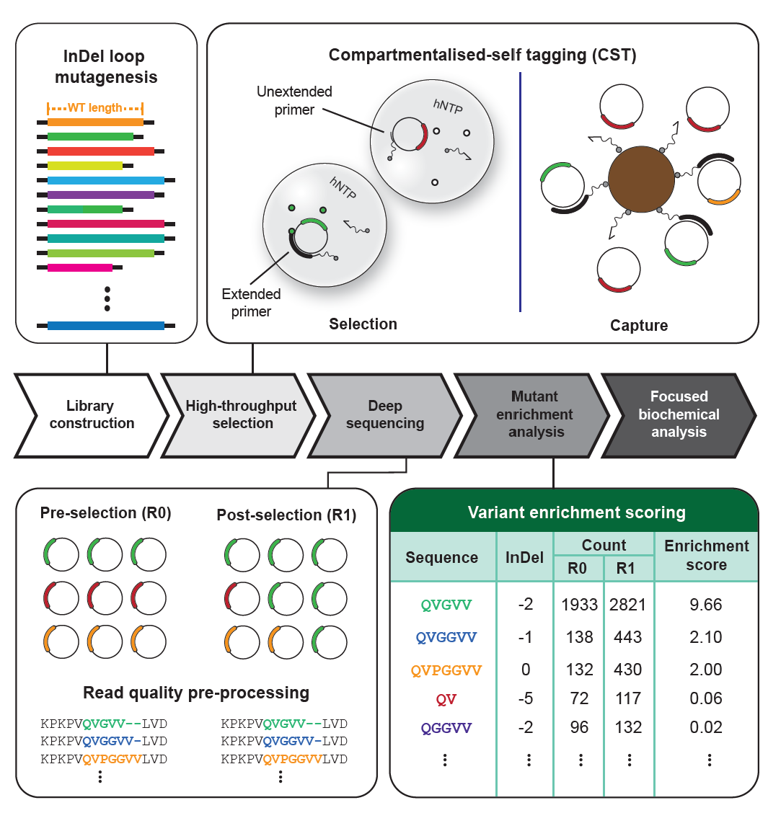
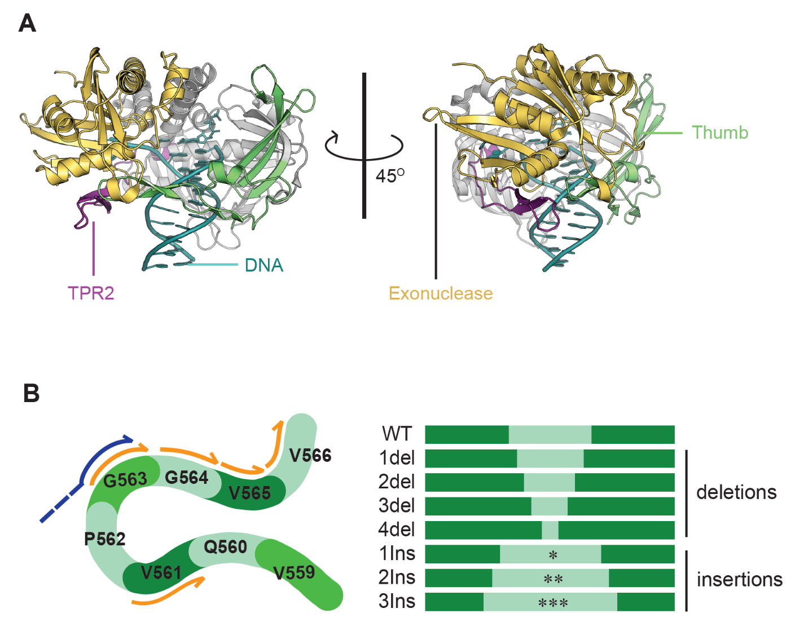
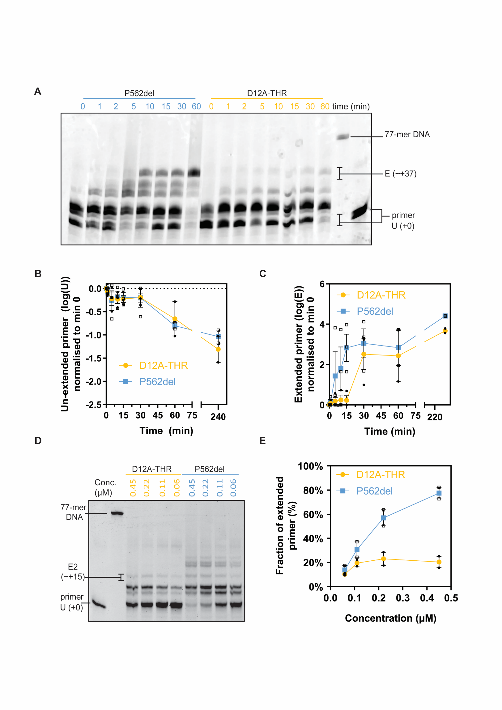
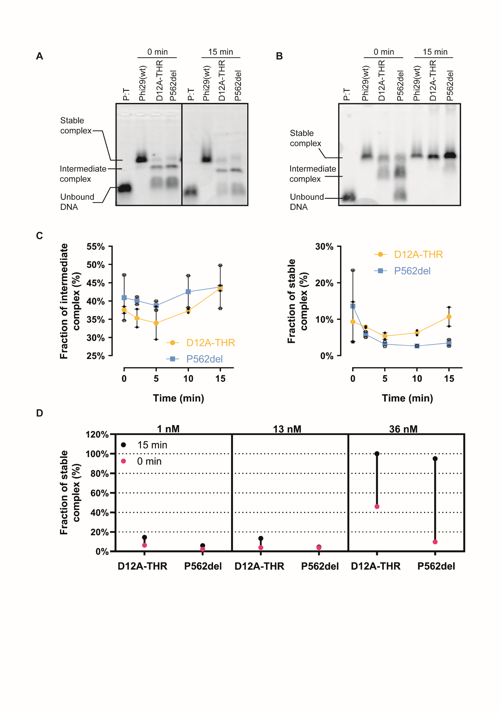
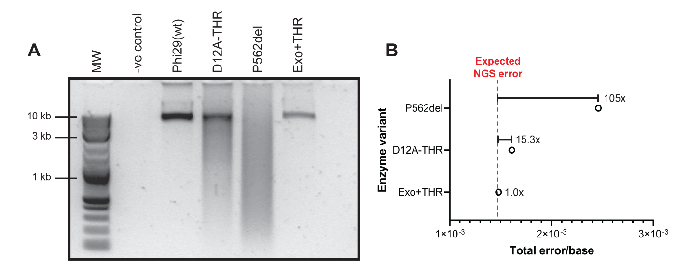

# Directed evolution of mesophilic HNA polymerases providing insight into DNA polymerase mechanisms

**Authors:**

Ms. Paola Handal-Marquez1,2, Dr. Leticia L.
Torres1 and Prof. Dr. Vitor B. Pinheiro2\*

**Affiliations:**

1 University College London, Department of Structural and
Molecular Biology, Gower Street, WC1E 6BT, London, UK

2 KU Leuven, Rega Institute for Medical Research, Department
of Pharmaceutical and Pharmacological Sciences, Herestraat, 49 – box
1041, 3000 Leuven, Belgium

**Corresponding author information:** \* e-mail:
v.pinheiro@kuleuven.be

**Abstract**

Detailed biochemical characterization of natural and mutant enzymes
provides essential clues to understand their mechanisms. There are,
however, limits to the throughput of such approaches and they are not
without errors. DNA polymerases have benefited from over 50 years of
detailed study and remain not fully understood. As such, methods that
allow high-throughput interrogation of variants, and viable analysis
pipelines to identify relevant variants, become an important tool to
accelerate research. Using the DNA polymerase from *B. subtilis* Phi29
bacteriophage as a model, we demonstrate how coupling focused libraries,
selection and deep sequencing can be combined to identify variants of
interest for characterization. As selection parameters can be
controlled, different areas of an enzyme’s mechanism can be explored.
Focusing selection on faster HNA (1,5-anhydrohexitol nucleic acid)
synthesis, we identified P562del as a variant of interest, enriching
significantly between rounds. Characterization confirmed its faster HNA
synthesis initiation but lower processivity and fidelity. P562 is a
non-conserved residue, unlikely to be selected by more traditional
approaches, but its deletion recapitulates knowledge on how Phi29
exonuclease, thumb and TPR2 subdomains regulate polymerase function. Our
data further support the hypothesis that Phi29 shows a two-state binding
to its template: a fast non-replicative complex that transitions to a
replication-competent state.

**Keywords:**

Directed evolution; XNA synthase; Phi29 DNA polymerase; high-throughput
biochemistry

**Introduction**

It is essential for all living organisms to store and replicate their
genetic information. That process is carried out by specialist enzymes,
termed template-dependent DNA (or RNA) polymerases. Despite their
central role, the ancient origin of those proteins has given evolution
enough time and opportunity to explore a vast range of characteristics
and specializations, across processivity, fidelity, thermostability and
multimerization1,2. Those characteristics and specializations
are the result of functional and sequence constraints imposed during the
natural evolution of DNA polymerases, and they are not yet fully
understood. Replicative DNA-dependent DNA polymerases are often
multifunctional enzymes (harboring both polymerase and exonuclease
activities) with complex dynamics and operating under multiple, and
sometimes overlapping, layers of regulation. For instance, DNA
polymerases can often discriminate between their natural substrate
(deoxyribose nucleotide triphosphates) and other natural analogues
present in the cellular milieu (ribonucleotides, partially
phosphorylated nucleotides, and damaged nucleobases), even though the
analogues are present at a higher concentration than the
substrates3. This is done not only at incorporation in the
active site of the enzyme3,4, but also at multiple points
during the elongation process5,6.

Therefore, because of their complexity and as a result of their
evolution, specific mutations can have different impacts on the function
of homologous DNA polymerases. Mutations that in the *Escherichia coli*
bacteriophage T4 result in 10-fold reduction of viability7,
have no impact on the T4-related RB69 phage8. Similarly, a β
hairpin mutation that decreases fidelity in both T4 and RB69, does not
impact *S. cerevisiae* DNA polymerase δ (also a B-family
polymerase).9

Detailed biochemical and mutational analysis has been very successful at
identifying some of the sequence and structural determinants for the
different DNA polymerase functions, but they are limited to the models
we use to understand polymerases, to how those can be efficiently
tested, and to how generalizable they are.

Deep mutational scanning (DMS) uses directed evolution strategies to
assess the function of large numbers of protein mutants in
parallel10. Mutants are partitioned based on function with
high-throughput DNA sequencing used to map each population – thus
generating a picture of the functional space of the protein. Such an
approach bypasses gaps in our understanding of the
sequence-structure-function relationships of the targeted proteins and
has been successfully applied to engineer protein variants with novel
properties. Nonetheless, DMS is usually focused on the isolation of
desired variants (e.g. more efficient enzymes) rather than on the
exploitation of the informationally-rich mutational datasets, which have
the potential to improve our understanding of a protein’s
sequence-structure-function relationships.

DNA polymerases can be engineered for the synthesis of xenobiotic
nucleic acids (XNAs), and multiple novel mutations have been identified
that can modulate enzymatic function and further contribute to our
understanding of those enzymes11,12. However, as with DMS
approaches, improved functional understanding is a byproduct of the main
research goal. By shifting the focus from “best” to “all” active
mutants, we propose that the sequence landscape mapping in DMS and in
directed evolution experiments (as summarized in **Figure 1**), can be
harnessed to improving our understanding of protein function and to
studying the impact of selection parameters.

XNAs such as HNA (1,5-anhydrohexitol nucleic acid) are of great interest
for therapeutic and nanotechnology applications13 because of
its enhanced chemical and biological stability14, which also
make HNA a viable alternative genetic polymer for *in vivo*
applications, such as novel platforms for biological
containment15.

The hyperthermophilic DNA polymerase from *Thermococcus gorgonarius* was
the first DNA polymerase to be engineered for HNA synthesis. From a
starting variant that harboured 4 mutations, a further 14 mutations were
acquired in directed evolution to enable efficient HNA synthesis –
generating the enzyme named 6G1216. Nevertheless, the high
temperatures required by 6G12 for HNA synthesis were incompatible with
*in vivo* applications, prompting us to focus on mesophilic polymerases.

The high mutational load in 6G12 was hypothesised to reshape the enzyme
thumb domain to accommodate the nascent HNA/DNA helix. However, our
efforts on the *B. subtilis* bacteriophage Phi29, determined that
reducing (N62D) or abolishing (D12A) exonuclease activity in this
polymerase was sufficient to enable HNA synthesis17 – leading
us to propose that XNA/DNA-polymerase complex stability was the key
driving parameter for XNA synthesis, as also observed for engineered RNA
polymerases18.

The high processivity of Phi29 DNA polymerase, which can synthesize up
to 70 kb DNA per binding event19, is due in large part by the
tight interaction between exonuclease, thumb and TPR2 domain, and
therefore, a suitable focus of engineering for improving HNA synthesis
and for gaining further understanding of how those regions coordinate
enzyme processivity and fidelity.

***Figure 1:
Mesophilic XNA polymerase directed evolution pipeline.** A library is
initially constructed – represented (top left panel) by different
color/lengths compared to the wild-type. The library is then subjected
to a round(s) of selection through compartmentalized self-tagging (top
right panel). The library pre- and post-selection is sequenced through
NGS (bottom left panel). The proportion of highly active variants (e.g.,
green) should increase whereas that of variants with lower activity
(e.g., orange, and red) should decrease. NGS data is filtered for
quality and pre-processed data is then analyzed (bottom right). The
frequency of each mutant corresponds to its abundance in the library
pre- and post-selection. An enrichment score is used to evaluate the
increase (or decrease) in abundance of specific mutants within the
population and serves as a starting point for further analysis.*

Here, we describe the identification of single residue in the DNA
polymerase thumb (P562) implicated in Phi29 DNA polymerase processivity,
demonstrating that high-throughput selections can be harnessed as a
high-throughput biochemistry tool, allowing novel mechanistic insights
in enzyme function. We characterise the isolated enzyme to demonstrate
the impact of the mutation on DNA affinity, enzyme processivity,
fidelity and strand displacement activities. Finally, we confirm that
Phi29 DNA polymerase needs not only to bind DNA but also to switch to a
stable conformation to achieve highly processive DNA synthesis.

**Results**

**Library design: focused libraries sampling beyond biochemical
knowledge.**

Phi29 DNA polymerase processivity is closely associated with the
terminal protein region 2 (TRP2) subdomain, which forms a structure akin
to a sliding clamp around template and nascent DNA, and which harbours
multiple contacts with the thumb (along residues V559-V566) and
exonuclease (along residues T15-V24 and F65-N72) subdomains (see
**Figure 2A**).

Deletion of the TRP2 subdomain, does not affect the ratio between
exonuclease and polymerase activities of the polymerase but
significantly decreases polymerase affinity for DNA and its
processivity20. This is analogous to what is observed in the
T7 bacteriophage DNA polymerase (gp5), where high processivity is only
observed when a clamp-like structure is formed around the DNA by the
binding of the thioredoxin processivity factor21.

The close contacts between TRP2, thumb and exonuclease can, in
principle, affect other polymerase processes, including exonuclease
activity (given the packing against an alpha helix harbouring one of the
catalytic exonuclease residues – D66), exonuclease sampling (DNA
switching between polymerase and exonuclease catalytic sites, by
modulating how exonuclease and thumb interact), strand displacing
activity (through the interaction TRP2 with template DNA) and DNA
binding.

***Figure 2.
Structure of the closed ternary complex of Phi29 DNA Polymerase and
InDel library design.** (**A**) There domains in the Phi29 DNA
polymerase (PDB: 2PYJ) are involved in creating a clamp around the
nascent DNA duplex: the polymerase thumb (green), the exonuclease domain
(yellow) and the TPR2 domain (purple). The DNA duplex is shown in cyan.
(B) InDel mutagenesis of the thumb loop through inverse PCR (iPCR).
(**B**) A single reverse primer in combination with forward primers
harbouring 1-3 NNS codons or with priming sites that skipped 1-4 codons
were used to generate focused libraries or deletion mutants
respectively. The same approach was used to target the TPR2 and
exonuclease loops.*

Although there are multiple possible contacts between TRP2, thumb and
exonuclease subdomains, we hypothesised that contact between the three
loops (TRP2: L406-L412, thumb: V559-V566, and exonuclease T15-V24) is
likely functional, capable of providing the dynamic response needed for
polymerase-exonuclease balance and enzyme processivity.

Traditionally, libraries for directed evolution focus on introducing
amino acid substitutions without changes to sequence
length22. Nonetheless, via the engineering of an XNA ligase
based on the *Chlorella* virus DNA ligase23, we recently
determined that changes in length can be essential for the change in
substrate specificity, allowing nucleic acids with different helical
parameters to be accommodated into the enzyme’s active site. Given the
tight packing of the loops and the nascent DNA in Phi29 DNA polymerase,
we decided to investigate if optimization of sequence as well as length
could create new molecular interactions to stabilize protein binding to
the nascent heteroduplex and that could be limiting Phi29 to become a
highly processive HNA polymerase.

Only limited diversity can be introduced in the 29 residues, given the
rapid rise in the number of variants and the poor stability of the Phi29
DNA polymerase (half-life of 37 ± 4.5 min at 40°C, when in the presence
of stabilizing DNA template24). The wide range of available
DNA library assembly strategies allows length and compositional
variation to be introduced, randomly or in a targeted manner, across a
gene of interest25,26, such that technical bottlenecks in
library generation are no longer relevant. Instead, design is
constrained by the number of variants that can be generated and sampled
(linking design to selection methodology), considering the likely
destabilizing effect of a high mutational burden to the protein being
engineered.

Starting from a previously reported thermostabilized Phi29 DNA
polymerase24 (t1/2 \> 16 h at 40°C in the presence
of DNA), harboring the additional D12A mutation (which disables
exonuclease activity) to allow limited HNA synthesis, we opted to
concomitantly explore loop length in the three loops. Firstly, because
insertions and deletions (indels) tend to be least disruptive to protein
stability when they occur in loops. Secondly, we hypothesized that loop
distortions, due to indels, would be a more sensitive tool to study
loop-loop interaction than patterns of substitution, while also
minimizing library diversity. That is further supported by sequence
alignment with Phi29 DNA polymerase homologues (**Figure S1**), showing
that these regions can accept indels.

The tips of the loops (residues D19, N409 and P562) were used as seed in
design, with up to three insertions being introduced upstream of those
seeds, or up to four deletions targeting the seed and downstream
residues, as shown in **Figure 2B**. Exonuclease, TRP2 and thumb
libraries had each a theoretical maximum diversity of approximately 8425
variants – well within the sampling range of the chosen selection
platform (approximately 2 x 107 per experiment) and analysis
pipeline (between 5.0 and 7.0 x 104 of sequences per run).
Summary of the number of variants in the libraries pre-selection can be
found on **Table 1**.

Although guided by the polymerase structures and phylogeny, the
libraries are agnostic to the biochemical knowledge that
TRP220,27 and the Phi29 DNA polymerase
C-terminus28,29 are crucial for processivity, with a single
previous report targeting one of those residues27.

<table>
<colgroup>
<col style="width: 17%" />
<col style="width: 17%" />
<col style="width: 15%" />
<col style="width: 16%" />
<col style="width: 15%" />
<col style="width: 16%" />
</colgroup>
<thead>
<tr class="header">
<th>
<strong>InDel</strong>

<strong>size</strong>
</th>
<th><strong>Exo</strong> <strong>R0</strong></th>
<th>
<strong>InDel</strong>

<strong>Size</strong>
</th>
<th><strong>TPR2 R0</strong></th>
<th>
<strong>InDel</strong>

<strong>size</strong>
</th>
<th><strong>Thumb R0</strong></th>
</tr>
</thead>
<tbody>
<tr class="odd">
<td>0</td>
<td>543</td>
<td>0</td>
<td>366</td>
<td>0</td>
<td>195</td>
</tr>
<tr class="even">
<td>1</td>
<td>472</td>
<td>1</td>
<td>11520</td>
<td>1</td>
<td>107</td>
</tr>
<tr class="odd">
<td>2</td>
<td>14927</td>
<td>2</td>
<td>83</td>
<td>2</td>
<td>473</td>
</tr>
<tr class="even">
<td>3</td>
<td>13238</td>
<td>3</td>
<td>5405</td>
<td>3</td>
<td>8104</td>
</tr>
<tr class="odd">
<td>-1</td>
<td>26</td>
<td>-1</td>
<td>57750</td>
<td>-1</td>
<td>143</td>
</tr>
<tr class="even">
<td>-2</td>
<td>2421</td>
<td>-2</td>
<td>75</td>
<td>-2</td>
<td>2048</td>
</tr>
<tr class="odd">
<td>-3</td>
<td>195</td>
<td>-3</td>
<td>46</td>
<td>-3</td>
<td>11328</td>
</tr>
<tr class="even">
<td></td>
<td></td>
<td></td>
<td></td>
<td>-4</td>
<td>12944</td>
</tr>
<tr class="odd">
<td>Others</td>
<td>580</td>
<td></td>
<td>450</td>
<td></td>
<td>507</td>
</tr>
<tr class="even">
<td>Total</td>
<td>32402</td>
<td></td>
<td>75695</td>
<td></td>
<td>35849</td>
</tr>
<tr class="odd">
<td>
<em>Theoretical</em>

<em>library size</em>
</td>
<td><em>8424</em></td>
<td></td>
<td><em>8424</em></td>
<td></td>
<td><em>8425</em></td>
</tr>
</tbody>
</table>

***Table 1. Sequence coverage of starting libraries across the different
assembled lengths.** Details of NGS processing and analysis are
summarized in Figure S2 and Tables S3, S4 and S5.*

**Using enrichment to identify relevant mutations in selection**

High-throughput selections rely on systems that link the phenotype being
sought with efficient recovery of the responsible genotype, so that at
each round of selection, the genotype of active enzymes becomes more
frequent.

A variety of selection methodologies have been demonstrated for the
selection of DNA and XNA polymerases, including *in vivo*30,
phage display31, and emulsion-based methods such as CSR
(compartmentalised self-replication)32, CST
(compartmentalised self-tagging)33, and CBL
(compartmentalised bead-labelling)34. Technical
characteristics of each method shape the range of polymerase activities
that can be selected and what activities can emerge as selection
parasites (active enzymes that co-enrich with the desired activity).

CST relies on polymerases capable of stabilizing the binding of the
selection primer against their own gene through XNA synthesis (**Figure
1**). Given the diminishing return per XNA incorporation to the overall
primer stabilization (i.e. analogous to oligonucleotide length effects
on primer melting temperature), the pressure of CST selection is highest
on the first few incorporations, with CST selections working akin to a
high-pass filter (i.e. selection is unable to discriminate between
polymerases that can synthesise beyond a certain number of
incorporations). Expected parasites in this CST selection include
polymerases that can make use of the low concentrations of natural
cellular dNTPs still present, polymerases that express to significantly
higher levels or that are more thermostable.

For the selection of HNA polymerases with higher processivity, extension
time is a key parameter, sinceparameter since shorter extension times
are likely to benefit highly processive enzymes as well as polymerases
that can start XNA synthesis faster. The latter was not expected to be a
significant possibility, considering Phi29 high affinity for DNA
(KD = 1 µM in conditions close to the selection
conditions35) and in view of our experience engineering
thermostable XNA polymerases.

A single round of selection for HNA synthesis, with a short extension
time of 10 min compared to the 1 h needed by the starting enzyme (Phi29
DNA polymerase: D12A) for 72 incorporations, was carried out for each
library, followed by deep sequencing of naïve and selected libraries for
analysis. Frequency counting post-selection can be a suitable route to
identify best candidates but assumes that the starting library is devoid
of biases, working best for selection methodologies that have low
background (i.e. recovered genotypes that are randomly recovered) and
for late-stage selection campaigns (i.e. libraries that have already
been carried through multiple selection rounds and that are populated by
few variants)36. Given libraries were pooled (by site across
all designed lengths) and since they require PCR amplification
post-selection (two processes expected to introduce biases), we opted to
use enrichment as a measure of selection, thus normalizing
post-selection frequencies against pre-selection ones.

As expected, deletions were highly sampled in all three starting
libraries while insertions showed partial coverage of the available
sequence space. Based on the pre-selection NGS analysis, the diversity
of the libraries was estimated to range between 1963 (TPR2 library) and
4570 variants (exonuclease library) (**Figure S2**).

We filtered the datasets to focus on variants that were present in both
pre- and post-selection populations. We scored the sequences based on
the change in frequency between rounds multiplied by the average number
of observations, thus biasing detection towards well sampled sequences
that were also enriching due to selection. Statistical significance of
enrichment was tested (using only changes in sampling frequency) with an
E-test37, a sensitive test for detecting differences between
two Poisson distributions. Significantly enriched sequences are
summarised in **Table 2**.

Out of the identified mutants, P562del (Phi29 DNAP M8R, D12A, V51A,
M97T, G197D, E221K, Q497P, K512E, F526L, ΔP562) and PG563del (Phi29 DNAP
M8R, D12A, V51A, M97T, G197D, E221K, Q497P, K512E, F526L, ΔP562-G563)
variants were notable, having enriched better than the parental enzyme
(D12A-THR: Phi29 DNAP M8R, D12A, V51A, M97T, G197D, E221K, Q497P, K512E,
F526L) in selection. In view that deletion of P562 alone was sufficient
for the increased enrichment, we chose to focus on this variant for
further characterisation.

<table>
<colgroup>
<col style="width: 30%" />
<col style="width: 9%" />
<col style="width: 15%" />
<col style="width: 15%" />
<col style="width: 13%" />
<col style="width: 15%" />
</colgroup>
<thead>
<tr class="header">
<th>Thumb loop variants</th>
<th>InDel</th>
<th>
R0 Count

(n= 35849)
</th>
<th>
R1 Count

(n= 46907)
</th>
<th>EC</th>
<th>E-test</th>
</tr>
</thead>
<tbody>
<tr class="odd">
<td>KPKPVQV--GVVLVD</td>
<td>-2</td>
<td>1933</td>
<td>2821</td>
<td>9.7E+00</td>
<td>0.0E+00</td>
</tr>
<tr class="even">
<td>KPKPVQV-GGVVLVD</td>
<td>-1</td>
<td>138</td>
<td>443</td>
<td>1.1E+00</td>
<td>0.0E+00</td>
</tr>
<tr class="odd">
<td>KPKPVQVPGGVVLVD</td>
<td>0</td>
<td>132</td>
<td>430</td>
<td>1.0E+00</td>
<td>0.0E+00</td>
</tr>
<tr class="even">
<td>KPKPVQV-----LVD</td>
<td>-5</td>
<td>72</td>
<td>117</td>
<td>4.6E-02</td>
<td>1.4E-01</td>
</tr>
<tr class="odd">
<td>KPKPVQ--GGVVLVD</td>
<td>-2</td>
<td>96</td>
<td>132</td>
<td>1.6E-02</td>
<td>7.2E-01</td>
</tr>
<tr class="even">
<td>TPR2 loop variants</td>
<td><strong>InDel</strong></td>
<td>
<strong>R0 Count</strong>

<strong>(n= 75695)</strong>
</td>
<td>
<strong>R1 Count</strong>

<strong>(n= 73519)</strong>
</td>
<td><strong>EC</strong></td>
<td><strong>E-test</strong></td>
</tr>
<tr class="odd">
<td>YLKE NGALGFRLGEE</td>
<td>0</td>
<td>123</td>
<td>730</td>
<td>3.5E+00</td>
<td>0.0E+00</td>
</tr>
<tr class="even">
<td>YLKEGRGNGALGFRLGEE</td>
<td>3</td>
<td>56</td>
<td>94</td>
<td>4.0E-02</td>
<td>9.2E-04</td>
</tr>
<tr class="odd">
<td>YLK- -GALGFRLGEE</td>
<td>-2</td>
<td>49</td>
<td>79</td>
<td>2.7E-02</td>
<td>4.4E-03</td>
</tr>
<tr class="even">
<td>YLKEAGGNGALGFRLGEE</td>
<td>3</td>
<td>48</td>
<td>73</td>
<td>2.2E-02</td>
<td>1.4E-02</td>
</tr>
<tr class="odd">
<td>YLKERGGNGALGFRLGEE</td>
<td>3</td>
<td>38</td>
<td>57</td>
<td>1.3E-02</td>
<td>3.5E-02</td>
</tr>
<tr class="even">
<td>Exonuclease loop variants</td>
<td><strong>InDel</strong></td>
<td>
<strong>R0 Count</strong>

<strong>(n= 32402)</strong>
</td>
<td>
<strong>R1 Count</strong>

<strong>(n= 4544)</strong>
</td>
<td><strong>EC</strong></td>
<td><strong>E-test</strong></td>
</tr>
<tr class="odd">
<td>TKVE --RVWAYGYMN</td>
<td>-2</td>
<td>2329</td>
<td>406</td>
<td>2.4E+01</td>
<td>1.0E-01</td>
</tr>
<tr class="even">
<td>TKVE DCRVWAYGYMN</td>
<td>0</td>
<td>259</td>
<td>111</td>
<td>3.0E+00</td>
<td>1.0E-06</td>
</tr>
<tr class="odd">
<td>TKVEARDCRVWAYGYMN</td>
<td>2</td>
<td>192</td>
<td>46</td>
<td>5.0E-01</td>
<td>1.6E-01</td>
</tr>
<tr class="even">
<td>TKVEPGDCRVWAYGYMN</td>
<td>2</td>
<td>130</td>
<td>30</td>
<td>2.1E-01</td>
<td>3.3E-01</td>
</tr>
<tr class="odd">
<td>TKVERGDCRVWAYGYMN</td>
<td>2</td>
<td>224</td>
<td>38</td>
<td>1.9E-01</td>
<td>5.9E-01</td>
</tr>
</tbody>
</table>

***Table 2. Most enriched variants isolated from individual libraries.**
Sequence, counts, complex enrichment score (EC) and statistical
significance for the top 5 variants from each of the Phi29 DNAP
Exonuclease, TRP2, and thumb InDel loop libraries. The EC is calculated
as the difference in frequency between rounds, times the average number
of counts. Wild-type sequences and their corresponding scores are shown
in blue. Sequences with higher EC than the wild-type and significantly
enriched (E-test p-value \<0.05) are shown in red. Deletions are shown
as hyphens and insertions are shown in regular font (i.e. not bold).*

**Deletion of P562 reduces processivity and fidelity**

Although kinetic parameters of incorporation are often used to describe
DNA polymerase activity and fidelity (when carried out with non-cognate
substrates), they do not consider effects that emerge during elongation,
which are known to be significant for XNA synthesis31,38. For
instance, hexitol nucleotide triphosphate (hNTP) incorporation kinetics
is comparable to dNTP kinetics39 in the B-family
*Thermococcus litoralis* (Vent) DNA polymerase, yet the *T. litoralis*
polymerase cannot incorporate more than 7 hNTPs in a row. Therefore,
initial characterisation focused on confirming the increased activity of
P562del for HNA synthesis by primer extension using
concentration-normalised purified enzymes – confirming the results of
selection and analysis. In short reactions (60 min extension), as shown
in **Figure 3**, P562del indeed outperforms the starting D12A-THR
polymerase, synthesising longer HNAs (~37 incorporations vs. ~18 from
D12A-THR) and more efficiently (less visible un-extended primer). This
difference in activity is observed at a range of protein concentrations
(**Figure 3E**). Longer incubations (**Figure S3A**), however, allow
D12A-THR to match and eventually outperform P562del – differences that
cannot be seen with the natural nucleoside triphosphates. Notably, like
the previously reported ΔTPR2 mutant20, HNA synthesis by the
P562del is distributive while D12A-THR is processive (with few visible
accumulated intermediates between primer and full-length extension).
Primer extension using alternative templates ruled out possible
sequence-specific (**Figure S3B-C**).

***Figure 3. P562 deletion in Phi29 DNAP enables faster initiation of
HNA synthesis**. Primer extension assays for HNA synthesis were carried
out by incubating 10 pmol of single stranded DNA template pre-annealed
to 1 pmol of fluorescently labelled DNA primer (100 nM in the reaction
conditions) with 60 nM D12A-THR or P562del Phi29 DNAP over different
amounts of time. (**A**) HNA primer extension products synthesized by
D12A-THR and P562 mutants separated by denaturing PAGE. Un-extended
primer (U) and extension products of ~37 incorporations (E) are
highlighted. (**B**) Average depletion of un-extended primer (U) by
D12A-THR (orange) and P562del (blue) normalized to the earliest time
point (0 min). (**C**) Average extended products with ~37 incorporations
(E) by D12A-THR and P562del normalized to the earliest time point (0
min). P562del shows a faster start to its hNTP incorporations than
D12A-THR. (**D**) The effect of polymerase concentration on HNA primer
extensions at a fixed time point of 15 min. Un-extended primer (U) and
extension products of ~30 incorporations (E2) are highlighted. (**E**)
Fraction of extended primer (E2) after 15 min incubations with each
protein concentration used in (**D**). 3 biological replicates were
carried out for (**B-C**) and 2 biological replicates were carried out
for (**E**). In all cases, error bars show standard error of the mean.*

Multiple polymerase mechanisms could account for the “early burst”
phenotype observed. For instance, changes in binding affinity to the
template (which begins as dsDNA but changes into an HNA/DNA heteroduplex
as the polymerase extend the primer), changes in processivity (by
increasing the dissociation rate of the enzyme from the template), or a
drop in fidelity (misincorporations stall the polymerase and can also
lead to more frequent sampling of the editing conformations). We
therefore focused characterization on assays that could give some
insight into those processes, always comparing P562del, to the parental
enzymes, with (Exo+THR: Phi29 DNAP M8R, V51A, M97T, G197D, E221K, Q497P,
K512E, F526L) or without (D12A-THR) active exonuclease function.

***Figure 4.** **Phi29 DNAP P562del reduced DNA binding capacity.**
Commercial (NEB) Phi29 DNAP (Phi29(wt)), D12A-THR or P562del were
allowed to bind a fluorescently labelled primer pre-annealed to a ssDNA
template (**A**) EMSA reactions incubated for 0 min and 15 min with 13
nM of Phi29(wt), D12A-THR and P562del. (**B**) EMSA reactions incubated
for 0 min and 15 min with 36 nM of D12A-THR and P562de and 18 nM of
Phi29(wt) (capped at this concentration due to limit in reaction volume
and commercial Phi29 DNA polymerase concentration). (**C**) Fraction of
intermediate Pol-DNA complex (left), and the fraction of stable Pol-DNA
complex by D12A-THR (orange) and P562del (blue) (right) over time. Two
biological replicates were carried out and error bars represent the
standard error of the mean between experiments. (**D**) Fraction of
stable complex at the start of the reactions (0 min incubation -
magenta) and after 15 min incubation (black) with different protein
concentrations1, 13 and 36 nM of each mutant. These experiments were
carried out only once.*

Electrophoretic mobility shift assays (EMSAs) showed a significant
difference between P562del and D12A-THR (**Figure 4**). The parental
enzyme, as previously reported, shows complexes with two different
mobilities: an unstable intermediate that transitions to a stable
replication-competent complex20. The deletion of P562 changes
that equilibrium, with intermediate complexes visible for longer and at
higher polymerase concentrations. This shows that the stability of the
replication-competent complex is reduced. Reactions with longer
incubation times were also performed and showed the same pattern
(**Figure S4**).

Rolling circle amplification (RCA) confirmed the detrimental impact of
D12A40 and showed that deletion of P562 results in an enzyme
unable to perform RCA (**Figure 5A**). Average extension lengths appear
shorter than D12A-THR and no full-length product could be observed,
supporting that P562 may be an important contact between thumb and TPR2
subdomains, and essential for TPR2’s role in strand displacement and
high processivity. In the context of the previous primer extension and
EMSA results, this supports a role for P562 in the dissociation rate of
the polymerase from its DNA template.

DNA
synthesis fidelity was investigated using an adaptation of our
previously reported XNA fidelity assay, based on primer extension assays
(**Figure S3A**). Given the very low error rates shown by wild-type
Phi29 DNA polymerase (in the range between 3x10-6 and
9.5x10-6 errors per base 41,42), errors introduced
by PCR and deep sequencing steps significantly affect the data obtained.
Deep sequencing errors alone are reported around 4.73 x10-3
for MiSeq Illumina platforms43.

***Figure 5.** **Impaired rolling circle amplification (RCA) activity
and reduced fidelity Phi29 DNAP P562del**. (**A**) The RCA assay used 10
ng of plasmid template and 3 nM of each enzyme in a 3-hour reaction. A
sample without enzyme (-ve control) was used to confirm the
polymerase-dependent amplification. Restriction of the RCA yields
full-length products. (**B**) Relative fidelity of the D12A-THR and
p562del mutants to Exo+THR. The corrected total error rates from **Table
3** of each mutant were divided by that of the Exo+THR, resulting in the
relative fidelity scores.*

We opted to use Exo+THR fidelity data to normalize for PCR and deep
sequencing errors in the experiment, thus establishing a baseline
against which the impact of D12A and P562 could be measured. As
expected, disabling the exonuclease activity (D12A-THR) increased the
rate of substitutions by approximately an order of magnitude, while
showing marginal increases in deletions and insertions. Removal of P562
had a more pronounced effect, with substitution rates approximately
100-fold higher than Exo-THR and significant increases in deletion
(7-fold) and insertion (6-fold) frequencies (**Figure 5B** and **Table
3**).

| Mutant   | Substitution ratea | Deletion ratea | Insertion ratea | Total error rate    | Rb      | Corrected total error rate | Total bases |
|----------|-------------------------------|---------------------------|----------------------------|---------------------|--------------------|----------------------------|-------------|
| Exo+THR  | 1.4x10-3           | 9.0x10-5       | 4.0x10-6        | 1.5x10-3 | 2.6x103 | 9.5x10-6        | 1,754,723   |
| D12A-THR | 1.4x10-3           | 1.7x10-4       | 6.1x10-6        | 1.6x10-3 | 2.7x103 | 1.5x10-4        | 1,808,769   |
| P562del  | 1.8x10-3           | 6.1x10-4       | 2.3x10-5        | 2.5x10-3 | 2.7x103 | 9.9x10-4        | 1,834,463   |

***Table 3.** **Quantification of insertions, deletions, and
substitutions rates (errors/bp) of Phi29 DNAP mutants.** aRaw
error rates that do not consider PCR and NGS error rates. bR:
PCR and Error estimate calculated from the number of errors expected to
be introduced by the commercial Phi29 DNAP (using the published
9.5x10-6 error rate* 41*) and subtracting this
figure from the observed number of errors introduced by Exo+THR. The
remainder was used to calculate the expected PCR and NGS error estimate
for the total bases sequenced of the D12A-THR and p562del mutants.*

Detailed analysis of error identity and position showed
context-dependent mutational hot spots for the three tested enzymes but
particularly salient for P562del (**Figure S6-S7**). P562del also showed
elevated levels of transition substitutions (26.8%) compared to D12A-THR
(21.2%) – shown in **Figure S5C**.

The phenotype shown by P562del bear similarities to the previously
reported ΔTPR2, in that the variants form a less stable complex with
their template, resulting in lower processivity and loss of strand
displacement activity. That, however, is not sufficient to explain
P562del enrichment in selection and its increased initial rate of HNA
synthesis. Given the previous report of P562 interaction with
TPR220, we postulate that P562 deletion removes a critical
contact involved in regulating Phi29 polymerase binding to its template,
making the process more dynamic – faster at assembling
replication-competent complexes (explaining selection and primer
extension), and faster at dissociating from DNA (explaining lower DNA
binding stability and poor RCA performance). Dissociation from template
becomes even more likely once it becomes an HNA/DNA heteroduplex, as it
has been observed for other polymerases39, explaining the
“early burst” phenotype observed.

**Discussion**

DNA polymerases are essential for life and, logically, they have been
extensively studied in the last 60 years. In addition to biochemical
characterisation of natural enzymes, mutants – whether selected or
targeted – have also significantly contributed to our current detailed
mechanistic understanding of this family of enzymes12.

Nonetheless, that understanding remains incomplete for polymerases. For
instance, we still have no mechanistic understanding of how some natural
DNA-dependent DNA polymerases display reverse transcriptase activity –
such as the DNAP from *Thermus thermophilus* for RNA44, or
the DNAP from *Geobacillus stearothermophilus* for some
XNAs45. We do not know how to explain the different impact of
a given modification between different polymerase chassis46,
and we still compare enzyme activities at standardized conditions,
rather than at their individual reaction optimum47. Such lack
of understanding also explains the current generation of XNA
polymerases, which lag severely behind natural DNA polymerases (using
natural substrates) on processivity, fidelity and catalytic rates.

Numerous individual residues have been implicated in function, but they
cannot act in isolation. How the different residues interact as a system
to enable a polymerase to function remains elusive, with only a handful
of examples demonstrating that such systems exist48.

For less well-characterised enzymes, the prospect of biochemically
characterising panels of mutants becomes increasingly difficult, and
only accessible by technically challenging high-throughput screening
platforms49. Still, selection platforms have the potential to
explore even higher throughputs (\> 107 variants) and at a
lower technical entry barrier (e.g. emulsion or *in vivo* platforms).

Selection platforms are at the core of directed evolution, but here the
emphasis is changed: rather than isolating a single best candidate,
conditions are chosen to recover functional enzymes that perform best at
the selected conditions. Consequently, there is greater need for robust
statistical analysis of selection outputs, and for a more systematic
exploration of how reaction conditions influence selection – areas that
are increasingly being considered in directed evolution.

We implement an E-test to compare how individual sequences enrich
between rounds, approximating individual sequence frequencies to Poisson
distribution parameters. It assumes a degree of robustness in selection
(so that frequencies can be good population estimates) that is only
justifiable for heavily oversampled libraries – here, designed libraries
were under 104 variants, transformations recovered in excess
of 106 CFU and CST selections are carried out with over
107 cells, fulfilling those criteria. Nonetheless, a natural
progression would be to include stochastic measures that assume
incomplete sampling, as commonly implemented for aptamer
selection50, and to extend analysis to include interacting
residues46,51.

Another crucial aspect of this approach is the library design.
Substitutions are traditionally used to sample sequence space around
wild-type enzymes, but they do not necessarily abolish backbone
interactions. The P562 residue is not conserved among homologous
Phi29-like enzymes, and a P562C mutation has been shown to have little
functional impact in reducing conditions27, suggesting that
its interaction with TPR2 and exonuclease domains may be the result of
backbone interactions. Indels, while abundant in nature, are usually
less explored as a tool for protein engineering52,53, because
of their expected impact on protein structure and increased complexity
in analysis.

While this work represents a proof-of-principle that selection can be
used to gain biological insight into the workings of a
well-characterised enzyme, it can be readily implemented to other
enzymes and at larger scales, towards reconstructing the functional
networks that define a protein function, such as obtained from
statistical coupling analysis54,55.

**MATERIALS AND METHODS**

**Library design, selection, NGS and analysis leading to the
identification of P562del.** The exonuclease, TPR2 and thumb loop InDel
libraries were generated through inverse PCR (iPCR) on the
pET23-P2-D12A-THR (**Table S1**) with phosphorylated InDel mutagenic
primers (**Table S2**) as previously described56 and
summarized in **Figure 2B**. Each InDel library was subjected to rounds
of selection through CST33 adapted for the mesophilic Phi29
DNAP as previously described56. Briefly, 1x108
cells from each library, post-induction (3 h at 30°C), were resuspended
in 100μl of activity reaction mix, composed of 30 pmol of a short
biotinylated oligo (CST_04(7)exoR, **Table S2**), 200 μM of hNTPs, 1x
Phi29 reaction buffer (NEB), 1x Bovine Serum Albumin (BSA, Sigma
Aldrich), 1 M betaine (Thermo Scientific), 2 μL NotI (NEB), 1 mg/mL
lysozyme (Thermo Scientific) and 5 μg/mL polymyxin (Sigma-Aldrich) in
100 μL molecular grade water. Resuspended cells were emulsified in
water-in-oil emulsions and subjected to freezing-thawing cycles for cell
lysis and plasmid denaturation. HNA synthesis was then carried out for
10 min at 30°C and products were captured, post-emulsion disruption, via
biotin-streptavidin pulldown using paramagnetic beads. Captured products
were amplified through PCR using KOD Xtreme Hot Start DNA Polymerase
(EMD Millipore), cloned into the pET23-P2-D12A-THR expression backbone,
and transformed into fresh electrocompetent *E. coli* T7 Express cells
(NEB). The libraries pre- and post-selection were then grown for 3 h at
37°C. Plasmids were then extracted and used as template in ~400 bp NGS
amplicon generation PCR reactions using KOD Xtreme Hot Start DNA
Polymerase (EMD Millipore) and NGS amplicon generation primers unique
for each library (**Table S2**). The amplicons were gel-extracted using
the Monarch DNA Gel Extraction kits (NEB). NGS-based amplicon sequencing
was carried out for all libraries at Genewiz UK Ltd using the
Amplicon-EZ service. Sequencing data, which can be found in the NCBI SRA
database (BioProject: PRJNA883233), was pre-processed using the
*NGS_preprocessing.ga* script (**Supplementary Information S2**) in the
Galaxy57 public server (usegalaxy.org). Total number of reads
and the impact of the pre-processing workflow can be found on **Tables
S3-S5**. Total number of reads and the impact of the pre-processing can
be found on **Tables S3-S5**. InDel frequencies before and after
selection, enrichment complex scores and the E-test for comparing two
Poisson means37 were calculated using the
*InDel_Quantification.ipynb* Julia notebook (**Supplementary Information
S3**). The complex enrichment score was calculated as:

$\left( {frequency}_{R1} - \ {frequency}_{R0} \right)\  \times \ \frac{({counts}_{R1} + {counts}_{R0})\ }{2}$
(1)

The calculated scores can be found in the *InDel_EC.xlsx* file
(**Supplementary Information S4**).

**Generation of Phi29 mutants.** The P562del and Exo+THR mutants were
generated on the pET23-P2-D12A-THR (**Table S1**) background through
inverse Polymerase Chain Reactions (iPCR) using Q5® High-Fidelity DNA
Polymerase (NEB) following the manufacturer’s instructions in 25 µl
reactions with primers p2_thumb_loop_R/DEL1 (**Table S2**) and
iPCR_P2_Exo+\_F1/R1 (**Table S2**), respectively. Amplified products
were treated with 0.4U/µL DpnI for 1 h at 37°C prior to the PCR
purification with the GeneJET PCR Purification Kit (Thermo Scientific).
100 ng of DNA products were blunt-end ligated in 20 µL reactions with
40U/µL T4 DNA ligase in 1x T4 DNA ligase buffer overnight at room
temperature. 5 µL of the ligation products were transformed in NEB®
5-alpha competent *E. coli* cells following the recommended High
Efficiency Transformation Protocol (C2987, New England Biolabs)
described by the commercial strain provider. Successful cloning was
confirmed through Sanger Sequencing in all cases.

**Expression, purification and protein quantification of mutants.** The
pET23 plasmid encoding the Phi29 DNA polymerase mutants were transformed
into *E. coli* T7 Express cells (NEB). Isolated transformants were grown
at 37°C until an OD600 of 0.8 was reached. Protein expression
was induced by adding IPTG to a final concentration of 1 mM and
incubating cultures for 4 h at 30°C. Cells were then pelleted through
centrifugation at 5000x*g* and the supernatant was discarded. Pellets
were frozen for an hour at -20°C and resuspended in 4 mL of B-PER
Reagent (Thermo Scientific) per gram of cell pellet with 50 mg/mL
lysozyme and 250U/uL Benzoase (Sigma Aldrich NV). Cells were
subsequently incubated at room temperature for 15 min. Protease
inhibitor (1 mM Pefabloc) and reducing agents (1 mM DTT) were added, and
cell debris removed through centrifugation at 5000x*g*. The supernatant
was diluted 3-fold in 50 mM Tris-HCl pH 8.0, 1 mM DTT and 1 mM Pefabloc.
Expressed protein was purified using the HisPur™ Ni-NTA Resin (Thermo
Scientific) using 50 mM Tris-HCl pH 8.0, 1 M NaCl, 1 mM DTT and
increasing concentrations of imidazole following the manufacturer’s
recommendations. Eluted proteins were concentrated, and buffer-exchanged
to 10 mM Tris-HCl, 100 mM KCl, 1 mM DTT, 0.1 mM EDTA, pH 7.4 at 25°C
using Amicon Ultra-4 Centrifugal 30 kDa Filter Units (Sigma Aldrich NV).
Glycerol (final concentration: 50% v/v), Tween 20 (0.5%), Nonidet P40
(0.5%) were then added for long term storage at -20°C.

To quantify protein concentration, a series of Bovine Serum Albumin
(BSA) standards in the 100 μg/ml to 1,200 μg/ml range were run in
parallel to the concentrated proteins in an SDS-PAGE gel to establish a
BSA standard curve used to determine the concentration of the mutants
and commercial Phi29 DNA polymerase.

**Primer Extension Assay for HNA synthesis.** Reactions were prepared by
mixing in 10 µL: 1x NEB 10X Phi29 DNAP buffer, 0.1 mg BSA, 1 M Betaine,
0.2 mM hNTPs, 0.06 μM (unless stated otherwise) of each Phi29 DNAP
mutant and 10 pmol of single stranded DNA template, TempN-exoR (**Table
S2**) pre-annealed to 1 pmol of fluorescently labelled DNA primer,
Tag01F3-exoR (**Table S2**). Pre-annealing was carried out by incubating
primer and template at 95°C for 5 min and cooling them down to 4°C at a
rate of 0.1°C/sec in a thermocycler. The primer extension assays were
incubated at 30°C from 1 min to 16 h (depending on the experiment) but
always inactivated by incubating it at 65°C for 20 min. Samples were
diluted in an equal volume of 2x loading buffer (98% (v/v) formamide, 10
mM ethylenediaminetetraacetic acid (EDTA), 0.02% (w/v) Orange G) and
boiled at 95°C for 5 min. Samples were loaded on 20% TBE-Urea
polyacrylamide gels and run in 1X TBE buffer at 25 W for 2 hours. Gels
were imaged using a TyphoonTM FLA 9500 biomolecular imager
(GE Healthcare) using recommended filter and detector settings based on
the fluorophore being used and analysed with ImageJ58. Three
independent experiments (biological replicates, n = 3) were carried out
for the quantification of the primer extension assays.

**DNA Binding Assay – Electrophoretic mobility shift assay (EMSA).** The
EMSA protocol was adapted from Povilaitis *et al.*24.
Oligonucleotide Tag01F_ExoR (**Table S2**) was annealed to TemN-ExoR
(**Table S2**) at a 1:1.2 molar ratio in the presence of 0.2 M NaCl and
60 mM Tris–HCl, pH 7.5 by incubating at 95°C for 5 min and cooling down
to 4°C at a rate of 0.1°C/sec in a thermocycler. A 50 μL complex-forming
reaction was prepared by mixing 33 mM Tris-acetate pH 7.9, 66 mM
potassium acetate, 10% glycerol, 0.1 mg/ml BSA with the 2 pmol
pre-annealed primer/template substrate (40 nM in the reaction
conditions) and 1 ~ 60 nM of each corresponding enzyme. Reactions were
incubated at 30°C for different time intervals (0, 15, 30 or 60 min).
After incubation, samples were mixed with loading dye (10% glycerol and
0.03% orange G) and analysed by electrophoresis in 0.8% (w/v) agarose
gel in 0.25x TBE buffer (22.25 mM Tris, 22.25 mM boric acid, and 0.5 mM
EDTA pH 8.3). Electrophoresis was performed in 0.25x TBE buffer at room
temperature for 2 h at 100 V. Gels were imaged using the
TyphoonTM bioimager and quantified using ImageQuant TL 8.2
(Cytiva). Four independent experiments (biological replicates, n = 2)
were carried out for the quantification of the EMSA assays.

**Rolling Circle Amplification (RCA).** 100 pmol of P2_RCA_N8_ExoR
(5’-NNNNNN\*N\*N-3’, **Table S2**) with two phosphorothioate-linked DNA
bases at the 3’ end for exonuclease resistance was pre-annealed to 10 ng
of pET23_P2_D12A_THR (**Table S1**) plasmid in 1x NEB 10X Phi29 DNAP
buffer, per 100 µL RCA reaction, by incubating them at 95°C for 5 min
and cooling them down to 4°C at a rate of 0.1°C/sec in a thermocycler.
The pre-annealed template mix was supplemented with 0.2 mM dNTPs, 0.2
mg/mL BSA, 5 ng ETSSB (NEB), 4 nM of each Phi29 DNAP mutant in a 100 µL
reaction and incubated for 3 h at 30°C. The RCA products were digested
with 10U of NotI in 1x Cutsmart buffer for 1 h at 37°C. The digested RCA
products were loaded on an agarose gel for visualisation.

**Isothermal polymerase fidelity assay.** Single-stranded template was
generated by mixing 1.8 pmol of pET23_KOD_DA_Mut (**Table S1**) with
0.7U/μL Nb.BbvCI, 10U/μL of ExoIII and 1x Cutsmart buffer in a 30 μL
reaction. 10 pmol of PH_pET23_DA_Biotin3 (**Table S2**) biotinylated
oligonucleotide (4.9 μL) was pre-annealed to 0.2 pmol of single stranded
template by incubating the mixture at 95°C for 5 min and cooling them
down to 4°C at a rate of 0.1°C/sec in a thermocycler. The annealed
primer-template was made up to 50 μL with deionized distilled water
(ddH2O). 5 μL of Dyanabeads MyOne C1 (ThermoFisher), per
reaction, were washed twice with 100 μL of 2x BWBS-T (20 mM Tris-HCl pH
7.4, 2 M NaCl, 0.2% v/v Tween20, 2 mM EDTA) and blocked in 1 mL 2x
BWBS-T on a rotator for 1 h at room temperature. Beads were captured,
resuspended in 50 μL 2x BWBS-T, and mixed with the 50 μL reaction prior
to being incubated for 3 h on a rotator at room temperature. Beads were
washed twice with 200 μL 30 mM NaOH at 37°C, then with 200 μl EB-T (10
mM Tris-HCl pH 8.8, 0.1 mM EDTA, 0.01% Tween20). Beads were resuspended
in 10 μL elution buffer (10 mM Tris-HCl, pH 8.5). Amplicons for deep
sequencing were generated using KOD Xtreme™ Hot Start DNA Polymerase
(EMD Millipore) following the manufacturer’s instructions in 50 μL
reactions with 1 µL of the resuspended beads as template, and outnest_1
(**Table S2**) and P2_fidelity_inestR1 (**Table S2**) as primers. The
cycling parameters used were 2 min at 95˚C, followed by 20 cycles of 15
s at 98˚C, 15 s at 65˚C and 10 s at 68˚C, with a final polishing step of
2 min at 72˚C. Primers were degraded by adding 0.8U/uL Exonuclease I to
each 50 μL PCR reaction.

**Next Generation Sequencing of fidelity assay data and analysis.** The
amplicons described above were purified with the Monarch PCR and DNA
purification kit (New England Biolabs) and sent for NGS EZ Amplicon
Sequencing by Genewiz. NGS data was pre-processed in the Galaxy public
server (usegalaxy.org) using the *NGS_preprocessing.ga* script
(**Supplementary information S2**) and trimmed using part 1 of the Julia
(v1.7) *Fidelity_Quantification.jl* script (**Supplementary Information
S5**). The reference sequence, ‘Fidelity_ref’ (**Table S2**), was added
to the trimmed reads and the reads were then aligned using the random
chain algorithm of MAFFT version 759 on the MAFFT server
(mafft.cbrc.jp/alignment/server/large.html) with the following
parameters: *mafft --thread 8 --threadtb 5 --threadit 0 --inputorder
--randomchain input \> output*. The number of insertions, deletions, and
substitutions as well as the number of individual error types were
calculated by comparing in a per-base manner the aligned reads to the
reference ‘Fidelity_ref’ (**Table S2**) sequence within the alignment
using part 2 of the *Fidelity_Quantification.jl* script (**Supplementary
Information S5**). Raw error rates were obtained by dividing the sum of
the errors by the total number of bases sequenced. The PCR and NGS error
(R) estimate for Exo+THR was obtained by subtracting the expected number
of errors of the commercial Phi29 DNAP (using the published error rate
9.5x10-6) from the observed number of errors by Exo+THR as
follows:

$$R_{Exo + THR}\  = {(Error\ rate}_{Exo + THR} \times {Total\ bases}_{Exo + THR)} - ({Error\ rate}_{phi29} \times {Total\ bases}_{Exo + THR})
$$(2)

The ${Err}_{Exo + THR}$ score was then used to calculate the PCR and NGS
error of the D12A-THR and p562del mutants as follows:

$R_{mutant}\  = \frac{R_{Exo + THR}}{{Total\ bases}_{Exo + THR} \times \ {Total\ bases}_{mutant}}$
(3)

The corrected total error rates were then calculated by dividing the
corrected error number over the total bases sequenced from each variant.

The location (start position, end position and length) and frequency of
each Indel across the MSA were obtained using part2 of the
*Fidelity_Quantification.jl* script (**Supplementary Information S5**),
by comparing each sequence to the ‘Fidelity_ref’ sequence within the
alignment. The frequency values were divided by the total number of
insertions or deletions and multiplied by 100 to obtain a relative
frequency distribution. Only sequences \>5% relative frequency were
plotted.

**AVAILABILITY**

All raw and processed data used in this manuscript are available in our
GitHub repository
([https://github.com/PinheiroLab/](https://github.com/PinheiroLab/Engineered_colE1_origins)
).

**ACCESSION NUMBERS**

Next generation sequencing data has been deposited on NCBI SRA under the
following accession number: PRJNA883233.

**ACKNOWLEDGEMENTS**

VBP, LLT and PHM thank ERASynBio (grant BB/N01023X/1; *invivo*XNA). VBP
and PHM thank FWO (grant G0H7618N). PHM thanks FWO (studentship
3M180645).

**CONTRIBUTIONS**

**Paola Handal-Marquez:** conceptualization, methodology, investigation,
formal analysis, data curation, writing, visualization and funding
acquisition. **Leticia L. Torres:** conceptualization, methodology,
supervision. **Vitor B. Pinheiro:** conceptualization, methodology,
formal analysis, writing, visualization, supervision, project
administration and funding acquisition.

**  
**

**REFERENCES**

\(1\) Garmendia, C.; Bernad, A.; Esteban, J. A.; Blanco, L.; Salas, M.
The Bacteriophage Phi 29 DNA Polymerase, a Proofreading Enzyme. *Journal
of Biological Chemistry* **1992**, *267* (4), 2594–2599.
https://doi.org/10.1016/S0021-9258(18)45922-4.

\(2\) Waters, L. S.; Minesinger, B. K.; Wiltrout, M. E.; D’Souza, S.;
Woodruff, R. V.; Walker, G. C. Eukaryotic Translesion Polymerases and
Their Roles and Regulation in DNA Damage Tolerance. *Microbiology and
Molecular Biology Reviews* **2009**, *73* (1), 134–154.
https://doi.org/10.1128/MMBR.00034-08/ASSET/7C1A9D97-7040-4080-8EF7-1F7B91B23BD8/ASSETS/GRAPHIC/ZMR0010922090004.JPEG.

\(3\) Wang, W.; Wu, E. Y.; Hellinga, H. W.; Beese, L. S. Structural
Factors That Determine Selectivity of a High Fidelity DNA Polymerase for
Deoxy-, Dideoxy-, and Ribonucleotides. *Journal of Biological Chemistry*
**2012**, *287* (34), 28215–28226.
https://doi.org/10.1074/jbc.M112.366609.

\(4\) Tsai, Y. C.; Johnson, K. A. A New Paradigm for DNA Polymerase
Specificity. *Biochemistry* **2006**, *45* (32), 9675–9687.
https://doi.org/10.1021/bi060993z.

\(5\) Khare, V.; Eckert, K. A. The Proofreading 3′ → 5′ Exonuclease
Activity of DNA Polymerases: A Kinetic Barrier to Translesion DNA
Synthesis. *Mutation Research - Fundamental and Molecular Mechanisms of
Mutagenesis* **2002**, *510* (1–2), 45–54.
https://doi.org/10.1016/S0027-5107(02)00251-8.

\(6\) Freund, N.; Taylor, A. I.; Arangundy-Franklin, S.; Subramanian,
N.; Peak-Chew, S. Y.; Whitaker, A. M.; Freudenthal, B. D.; Abramov, M.;
Herdewijn, P.; Holliger, P. A Two-Residue Nascent-Strand Steric Gate
Controls Synthesis of 2′-O-Methyl- and 2′-O-(2-Methoxyethyl)-RNA. *Nat
Chem* **2022**. https://doi.org/10.1038/s41557-022-01050-8.

\(7\) Frey, M. W.; Nossal, N. G.; Capson, T. L.; Benkovic, S. J.
Construction and Characterization of a Bacteriophage T4 DNA Polymerase
Deficient in 3’ → 5’ Exonuclease Activity. *Proc Natl Acad Sci U S A*
**1993**, *90* (7), 2579–2583. https://doi.org/10.1073/PNAS.90.7.2579.

\(8\) Bebenek, A.; Dressman, H. K.; Carver, G. T.; Ng, S. S.; Petrov,
V.; Yang, G.; Konigsberg, W. H.; Karam, J. D.; Drake, J. W. Interacting
Fidelity Defects in the Replicative DNA Polymerase of Bacteriophage
RB69. *Journal of Biological Chemistry* **2001**, *276* (13),
10387–10397. https://doi.org/10.1074/JBC.M007707200.

\(9\) Darmawan, H.; Harrison, M.; Reha-Krantz, L. J. DNA Polymerase
3’→5’ Exonuclease Activity: Different Roles of the Beta Hairpin
Structure in Family-B DNA Polymerases. *DNA Repair (Amst)* **2015**,
*29*, 36–46. https://doi.org/10.1016/j.dnarep.2015.02.014.

\(10\) Fowler, D. M.; Fields, S. Deep Mutational Scanning : A New Style
of Protein Science. **2014**, *11* (8), 801–807.
https://doi.org/10.1038/nmeth.3027.

\(11\) Laos, R.; Thomson, J. M.; Benner, S. A. DNA Polymerases
Engineered by Directed Evolution to Incorporate Nonstandard Nucleotides.
*Front Microbiol* **2014**, *5* (OCT), 1–14.
https://doi.org/10.3389/fmicb.2014.00565.

\(12\) Pinheiro, V. B. Engineering-Driven Biological Insights into DNA
Polymerase Mechanism. *Curr Opin Biotechnol* **2019**, *60*, 9–16.
https://doi.org/10.1016/j.copbio.2018.11.008.

\(13\) Pinheiro, V. B.; Holliger, P. Towards XNA Nanotechnology: New
Materials from Synthetic Genetic Polymers. *Trends Biotechnol* **2014**,
*32* (6), 321–328. https://doi.org/10.1016/j.tibtech.2014.03.010.

\(14\) Pinheiro, V. B.; Taylor, A. I.; Cozens, C.; Abramov, M.; Renders,
M.; Zhang, S.; Chaput, J. C.; Wengel, J.; Peak-Chew, S.-Y.; McLaughlin,
S. H.; Herdewijn, P.; Holliger, P. SI Synthetic Genetic Polymers Capable
of Heredity and Evolution. *Science (1979)* **2012**, *336* (6079),
341–344. https://doi.org/10.1126/science.1217622.

\(15\) Torres, L.; Krüger, A.; Csibra, E.; Gianni, E.; Pinheiro, V. B.
Synthetic Biology Approaches to Biological Containment: Pre-Emptively
Tackling Potential Risks. *Essays Biochem* **2016**, *60* (4), 393–410.
https://doi.org/10.1042/EBC20160013.

\(16\) Pinheiro, V. B.; Taylor, A. I.; Cozens, C.; Abramov, M.; Renders,
M.; Zhang, S.; Chaput, J. C.; Wengel, J.; Peak-Chew, S. Y.; McLaughlin,
S. H.; Herdewijn, P.; Holliger, P. Synthetic Genetic Polymers Capable of
Heredity and Evolution. *Science (1979)* **2012**, *336* (6079),
341–344. https://doi.org/10.1126/science.1217622.

\(17\) Torres, L. L.; Pinheiro, V. B. Xenobiotic Nucleic Acid (XNA)
Synthesis by Phi29 DNA Polymerase. *Curr Protoc Chem Biol* **2018**,
*10* (2), e41. https://doi.org/10.1002/cpch.41.

\(18\) Cozens, C.; Pinheiro, V. B.; Vaisman, A.; Woodgate, R.; Holliger,
P. A Short Adaptive Path from DNA to RNA Polymerases. *Proceedings of
the National Academy of Sciences* **2012**, *109* (21), 8067–8072.
https://doi.org/10.1073/pnas.1120964109.

\(19\) Lieberman, K. R.; Cherf, G. M.; Doody, M. J.; Olasagasti, F.;
Kolodji, Y.; Akeson, M. Processive Replication of Single DNA Molecules
in a Nanopore Catalyzed by Phi29 DNA Polymerase. *J Am Chem Soc*
**2010**, *132* (50), 17961–17972. https://doi.org/10.1021/ja1087612.

\(20\) Rodriguez, I.; Lazaro, J. M.; Blanco, L.; Kamtekar, S.; Berman,
A. J.; Wang, J.; Steitz, T. A.; Salas, M.; Vega, M. de. A Specific
Subdomain in Φ29 DNA Polymerase Confers Both Processivity and
Strand-Displacement Capacity. *Proceedings of the National Academy of
Sciences* **2005**, *102* (18), 6407–6412.

\(21\) Tran, N. Q.; Lee, S. J.; Akabayov, B.; Johnson, D. E.;
Richardson, C. C. Thioredoxin, the Processivity Factor, Sequesters an
Exposed Cysteine in the Thumb Domain of Bacteriophage T7 DNA Polymerase.
*Journal of Biological Chemistry* **2012**, *287* (47), 39732–39741.
https://doi.org/10.1074/jbc.M112.409235.

\(22\) Miton, C. M.; Tokuriki, N. Insertions and Deletions (Indels): A
Missing Piece of the Protein Engineering Jigsaw. *Biochemistry*
**2023**, *62* (2), 148–157.
https://doi.org/10.1021/ACS.BIOCHEM.2C00188/ASSET/IMAGES/LARGE/BI2C00188_0003.JPEG.

\(23\) Vanmeert, M.; Razzokov, J.; Mirza, M. U.; Weeks, S. D.; Schepers,
G.; Bogaerts, A.; Rozenski, J.; Froeyen, M.; Herdewijn, P.; Pinheiro, V.
B.; Lescrinier, E. Rational Design of an XNA Ligase through Docking of
Unbound Nucleic Acids to Toroidal Proteins. *Nucleic Acids Res*
**2019**, *47* (13), 7130–7142. https://doi.org/10.1093/nar/gkz551.

\(24\) Povilaitis, T.; Alzbutas, G.; Sukackaite, R.; Siurkus, J.;
Skirgaila, R. In Vitro Evolution of Phi29 DNA Polymerase Using
Isothermal Compartmentalized Self Replication Technique. *Protein
Engineering, Design and Selection* **2016**, *29* (12), 617–628.
https://doi.org/10.1093/protein/gzw052.

\(25\) Lutz, S. Beyond Directed Evolution - Semi-Rational Protein
Engineering and Design. **2011**, *21* (6), 734–743.
https://doi.org/10.1016/j.copbio.2010.08.011.Beyond.

\(26\) Chica, R. A.; Doucet, N.; Pelletier, J. N. Semi-Rational
Approaches to Engineering Enzyme Activity : Combining the Benefits of
Directed Evolution and Rational Design. *Curr Opin Biotechnol* **2005**,
No. 16, 378–384. https://doi.org/10.1016/j.copbio.2005.06.004.

\(27\) Rodríguez, I.; Lázaro, J. M.; Salas, M.; de Vega, M. Involvement
of the TPR2 Subdomain Movement in the Activities of Φ29 DNA Polymerase.
*Nucleic Acids Res* **2009**, *37* (1), 193–203.
https://doi.org/10.1093/nar/gkn928.

\(28\) Kamtekar, S.; Berman, A. J.; Wang, J.; Lázaro, J. M.; de Vega,
M.; Blanco, L.; Salas, M.; Steitz, T. A. Insights into Strand
Displacement and Processivity from the Crystal Structure of the
Protein-Primed DNA Polymerase of Bacteriophage Φ29. *Mol Cell* **2004**,
*16* (4), 609–618. https://doi.org/10.1016/j.molcel.2004.10.019.

\(29\) Truniger, V.; Lazaro, J. M.; Salas, M. Function of the C-Terminus
of Phi29 DNA Polymerase in DNA and Terminal Protein Binding. *Nucleic
Acid Ther* **2004**, *32* (1), 361–370.
https://doi.org/10.1093/nar/gkh184.

\(30\) Patel, P. H.; Loeb, L. A. Multiple Amino Acid Substitutions Allow
DNA Polymerases to Synthesize RNA. *Journal of Biological Chemistry*
**2000**, *275* (51), 40266–40272.
https://doi.org/10.1074/jbc.M005757200.

\(31\) Xia, G.; Chen, L.; Sera, T.; Fa, M.; Schultz, P. G.; Romesberg,
F. E. Directed Evolution of Novel Polymerase Activities: Mutation of a
DNA Polymerase into an Efficient RNA Polymerase. *Proc Natl Acad Sci U S
A* **2002**, *99* (10), 6597–6602.
https://doi.org/10.1073/pnas.102577799.

\(32\) Ghadessy, F. J.; Ong, J. L.; Holliger, P. Directed Evolution of
Polymerase Function by Compartmentalized Self-Replication. *Proceedings
of the National Academy of Sciences* **2001**, *98* (8), 4552–4557.
https://doi.org/10.1073/pnas.071052198.

\(33\) Pinheiro, V. B.; Arangundy-franklin, S.; Holliger, P.
Compartmentalized Self-Tagging for In Vitro-Directed Evolution of XNA
Polymerases. *Curr Protoc Nucleic Acid Chem* **2014**, *57*,
9.9.1-9.9.18. https://doi.org/10.1002/0471142700.nc0909s57.

\(34\) Houlihan, G.; Arangundy-Franklin, S.; Porebski, B. T.;
Subramanian, N.; Taylor, A. I.; Holliger, P. Discovery and Evolution of
RNA and XNA Reverse Transcriptase Function and Fidelity. *Nat Chem*
**2020**, *12* (August), 1–8. https://doi.org/10.1038/s41557-020-0502-8.

\(35\) Lázaro, J. M.; Blanco, L.; Salas, M. Purification of
Bacteriophage Φ29 DNA Polymerase. *Methods Enzymol* **1995**, *262* (C),
42–49. https://doi.org/10.1016/0076-6879(95)62007-9.

\(36\) Wrenbeck, E. E.; Faber, M. S.; Whitehead, T. A. Deep Sequencing
Methods for Protein Engineering and Design. *Curr Opin Struct Biol*
**2017**, *45*, 36–44. https://doi.org/10.1016/j.sbi.2016.11.001.

\(37\) Krishnamoorthy, K.; Thomson, J. A More Powerful Test for
Comparing Two Poisson Means. *J Stat Plan Inference* **2004**, *119*
(1), 23–35. https://doi.org/10.1016/S0378-3758(02)00408-1.

\(38\) Lutz, S.; Burgstaller, P.; Benner, S. A. An in Vitro Screening
Technique for DNA Polymerases That Can Incorporate Modified Nucleotides.
Pseudothymidine as a Substrate for Thermostable Polymerases. *Nucleic
Acids Res* **1999**, *27* (13), 2792–2798.
https://doi.org/10.1093/nar/27.13.2792.

\(39\) Vastmans, K.; Pochet, S.; Peys, A.; Kerremans, L.; van Aerschot,
A.; Hendrix, C.; Marliere, P.; Herdewijn, P. Enzymatic Incorporation in
DNA of 1,5-Anhydrohexitol Nucleotides. *Biochemistry* **2000**, *39*
(42), 12757–12765. https://doi.org/10.1021/bi001297g.

\(40\) Bernad, A.; Blanco, L.; Lázaro, J. M.; Martín, G.; Salas, M. A
Conserved 3′→5′ Exonuclease Active Site in Prokaryotic and Eukaryotic
DNA Polymerases. *Cell* **1989**, *59* (1), 219–228.
https://doi.org/10.1016/0092-8674(89)90883-0.

\(41\) Paez, J. G.; Lin, M.; Beroukhim, R.; Lee, J. C.; Zhao, X.;
Richter, D. J.; Gabriel, S.; Herman, P.; Sasaki, H.; Altshuler, D.; Li,
C.; Meyerson, M.; Sellers, W. R. Genome Coverage and Sequence Fidelity
of Phi29 Polymerase-Based Multiple Strand Displacement Whole Genome
Amplification. *Nucleic Acids Res* **2004**, *32* (9), 1–11.
https://doi.org/10.1093/nar/gnh069.

\(42\) Nelson, J. R.; Cai, Y. C.; Giesler, T. L.; Farchaus, J. W.;
Sundaram, S. T.; Ortiz-Rivera, M.; Hosta, L. P.; Hewitt, P. L.; Mamone,
J. A.; Palaniappan, C.; Fuller, C. W. TempliPhi, ⌽29 DNA Polymerase
Based Rolling Circle Amplification of Templates for DNA Sequencing.
*https://doi.org/10.2144/jun0208* **2018**, *32* (6 SUPPL.).
https://doi.org/10.2144/JUN0208.

\(43\) Stoler, N.; Nekrutenko, A. Sequencing Error Profiles of Illumina
Sequencing Instruments. *NAR Genom Bioinform* **2021**, *3* (1), 1–9.
https://doi.org/10.1093/NARGAB/LQAB019.

\(44\) Myers, T. W.; Gelfand, D. H. Reverse Transcription and DNA
Amplification by a Thermus Thermophilus DNA Polymerase. *Biochemistry*
**1991**, *30* (31), 7661–7666. https://doi.org/10.1021/bi00245a001.

\(45\) Jackson, L. N.; Chim, N.; Shi, C.; Chaput, J. C. Crystal
Structures of a Natural DNA Polymerase That Functions as an XNA Reverse
Transcriptase. *Nucleic Acids Res* **2019**, *47* (13), 6973–6983.
https://doi.org/10.1093/nar/gkz513.

\(46\) Nikoomanzar, A.; Vallejo, D.; Chaput, J. C. Elucidating the
Determinants of Polymerase Specificity by Microfluidic-Based Deep
Mutational Scanning. *ACS Synth Biol* **2019**, *8* (6), 1421–1429.
https://doi.org/10.1021/acssynbio.9b00104.

\(47\) Nikoomanzar, A.; Dunn, M. R.; Chaput, J. C. Evaluating the Rate
and Substrate Specificity of Laboratory Evolved XNA Polymerases. *Anal
Chem* **2017**, *89* (23), 12622–12625.
https://doi.org/10.1021/acs.analchem.7b03807.

\(48\) Li, V.; Hogg, M.; J, R.-K. L. Identification of a New Motif in
Family B DNA Polymerases by Mutational Analyses of the Bacteriophage T4
DNA Polymerase. *J Mol Biol* **2010**, *400* (3), 295–308.
https://doi.org/10.1016/j.jmb.2010.05.030.Identification.

\(49\) Gielen, F.; Hours, R.; Emond, S.; Fischlechner, M.; Schell, U.;
Hollfelder, F. Ultrahigh-Throughput-Directed Enzyme Evolution by
Absorbance-Activated Droplet Sorting (AADS). *Proc Natl Acad Sci U S A*
**2016**, *113* (47), E7383–E7389.
https://doi.org/10.1073/pnas.1606927113.

\(50\) Hoinka, J.; Berezhnoy, A.; Dao, P.; Sauna, Z. E.; Gilboa, E.;
Przytycka, T. M. Large Scale Analysis of the Mutational Landscape in
HT-SELEX Improves Aptamer Discovery. *Nucleic Acids Res* **2015**, *43*
(12), 5699–5707. https://doi.org/10.1093/nar/gkv308.

\(51\) Salinas, V. H.; Ranganathan, R. Coevolution-Based Inference of
Amino Acid Interactions Underlying Protein Function. *Elife* **2018**,
*7*, 1–20.

\(52\) Tóth-Petróczy, Á.; Tawfik, D. S. Protein Insertions and Deletions
Enabled by Neutral Roaming in Sequence Space. *Mol Biol Evol* **2013**,
*30* (4), 761–771. https://doi.org/10.1093/molbev/mst003.

\(53\) Tizei, P. A. G.; Harris, E.; Withanage, S.; Renders, M.;
Pinheiro, V. B. A Novel Framework for Engineering Protein Loops
Exploring Length and Compositional Variation. *Sci Rep* **2021**, *11*
(1), 1–13. https://doi.org/10.1038/s41598-021-88708-4.

\(54\) Lockless, S. W.; Ranganathan, R. Evolutionarily Conserved
Pathways of Energetic Connectivity in Protein Families. *Science (1979)*
**1999**, *286* (5438), 295–299.
https://doi.org/10.1126/SCIENCE.286.5438.295.

\(55\) Salinas, V. H.; Ranganathan, R. Coevolution-Based Inference of
Amino Acid Interactions Underlying Protein Function. *Elife* **2018**,
*7*. https://doi.org/10.7554/ELIFE.34300.

\(56\) Handal Marquez, P. Sampling the Functional Sequence Neighbourhood
of Phi29 DNA Polymerase for XNA Synthesis. *(MPhil) UCL (University
College London).* **2019**.

\(57\) Afgan, E.; Baker, D.; van den Beek, M.; Blankenberg, D.; Bouvier,
D.; Čech, M.; Chilton, J.; Clements, D.; Coraor, N.; Eberhard, C.;
Grüning, B.; Guerler, A.; Hillman-Jackson, J.; Kuster, G. von; Rasche,
E.; Soranzo, N.; Turaga, N.; Taylor, J.; Nekrutenko, A.; Goecks, J. The
Galaxy Platform for Accessible, Reproducible and Collaborative
Biomedical Analyses: 2016 Update. *Nucleic Acids Res* **2016**, *44*
(W1), W3–W10. https://doi.org/10.1093/nar/gkw343.

\(58\) Schneider, C. A.; Rasband, W. S.; Eliceiri, K. W. NIH Image to
ImageJ: 25 Years of Image Analysis. *Nat Methods* **2012**, *9* (7),
671–675. https://doi.org/10.1038/nmeth.2089.

\(59\) Katoh, K.; Standley, D. M. MAFFT Multiple Sequence Alignment
Software Version 7: Improvements in Performance and Usability. *Mol Biol
Evol* **2013**, *30* (4), 772–780.
https://doi.org/10.1093/molbev/mst010.

>  
