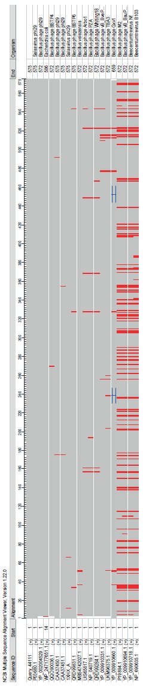
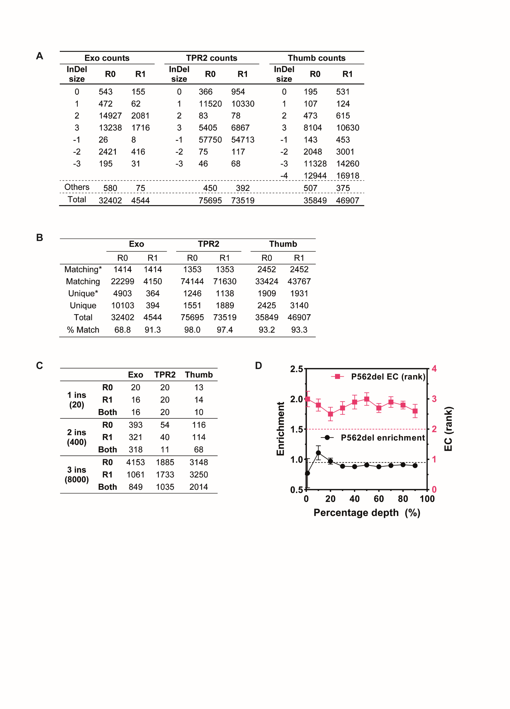
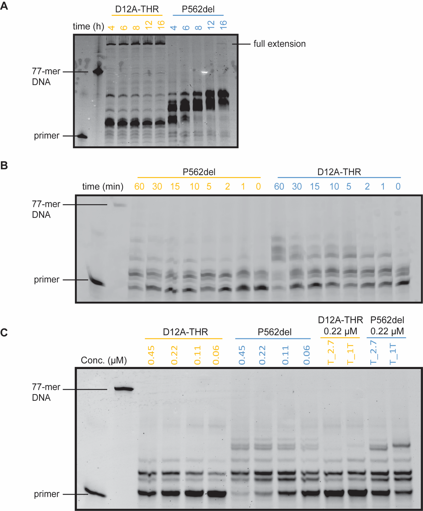
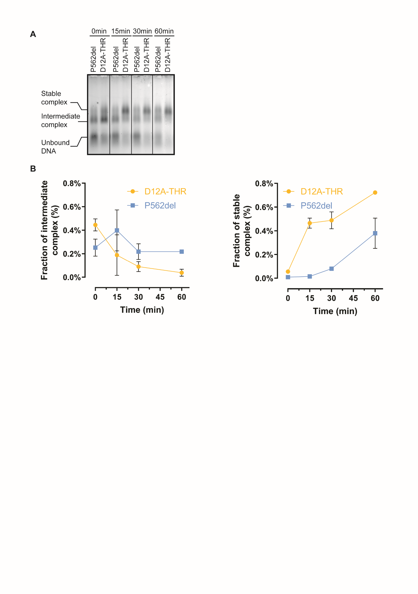
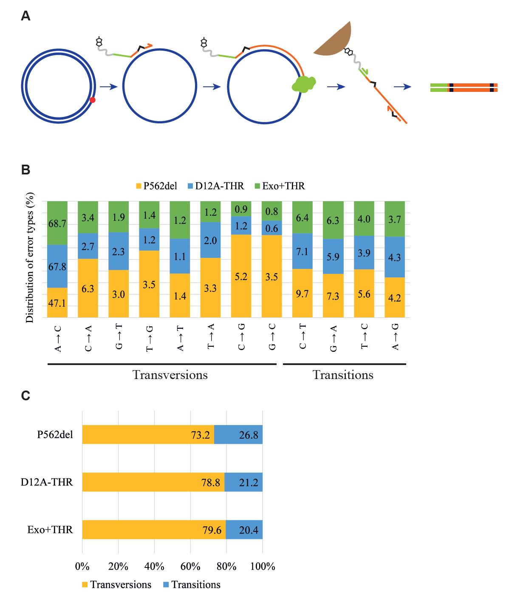
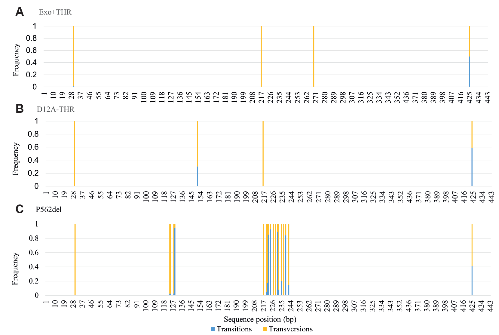
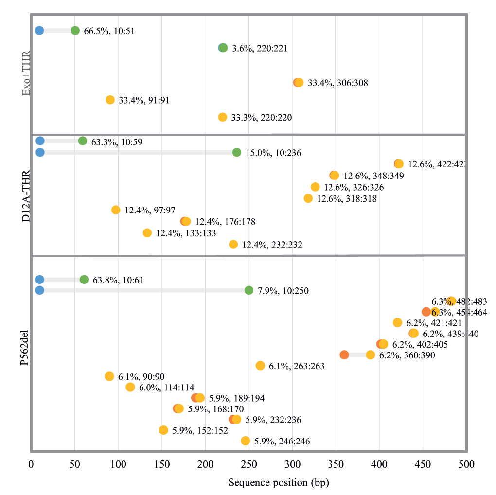

**Supplementary Information:**

**Directed evolution of mesophilic HNA polymerases providing insight
into DNA polymerase mechanisms.**

**Authors and affiliations:**

Paola Handal-Marquez1,2, Leticia L. Torres1 and
Vitor B. Pinheiro2\*

1 University College London, Department of Structural and
Molecular Biology, Gower Street, WC1E 6BT, London, UK

2 KU Leuven, Rega Institute for Medical Research, Department
of Pharmaceutical and Pharmacological Sciences, Herestraat, 49 – box
1041, 3000 Leuven, Belgium

\* Corresponding author: e-mail: v.pinheiro@kuleuven.be

**Table of Contents:**

Figure S1. Phi29 DNAP homologues in public
databases**……………………………….…..3**

Figure S2. InDel distribution and composition and sequencing depth
analysis**……………4**

Figure S3. HNA synthesis time courses by D12A-THR and p562del with
different templates and protein
concentrations**………………………………………………………....6**

Figure S4. Phi29 DNAP P562del reduced DNA binding capacity long time
course**……….8**

Figure S5. Phi29 DNAP P562del reduced fidelity and increased InDel
incorporations rate**…….………………………………………………………………………………………….9**

Figure S6. Transition and transversion hotspots introduced by phi29 DNAP
variants**………………………………………………………………………………………….11**

Figure S7. Location of most abundant InDel introductions by each mutant
during isothermal DNA replication**……………………………………………………………………12**

Table S1. Sequencesa of all the plasmids used in this
study**……………………….………14**

Table S2. Sequencesa of the oligonucleotides and templates
used in this study**………19**

Table S3. Analysis by next generation sequencing of the Exo loop library
recovered sequences**………………………………………………………………………………………22**

Table S4. Analysis by next generation sequencing of the TPR2 loop
library recovered sequences**……………………………………………………………………..……………….22**

Table S5. Analysis by next generation sequencing of the Thumb loop
library recovered sequences**………………………………………………………………………………………23**

Supplementary references**………………………………………………………………........24**

## 

**Figure S1. Phi29 DNAP
homologues in public databases.** Sequences with \>80% sequence identity
and \>80% query cover from a blast search of the Phi29 DNAP protein
sequence were selected, aligned using the NCBI Multiple Alignment
Tool1 and viewed using the NCBI’S Sequence
Viewer2. Mismatches relative to the query (Phi29 DNAP
sequence) are shown in red and insertions are indicated by a blue
bracket. Only 20 sequences show significant similarity to phi29 DNAP.

**Figure S2. InDel distribution and composition and sequencing depth
analysis**. (**A**) Total number of counts of each insertion and
deletion pre- (R0) and post-selection (R1) for each library. Deletions
are indicated with a negative sign and ‘Others’ corresponds to the sum
of unintended mutation potentially from sequencing errors. (**B**)
Number of sequences that appear in both pre- (R0) and post-selection
(R1) datasets (matching) or appear either on the R0 or R1 datasets
(unique). The “\*” shows the same matching or unique sequences found
with their respective abundance disregarded (deduped). Most of the
unique sequences contained stop codons which could be a result of
sequencing errors. (**C**) Amino acid combinations identified across 1,
2 and 3 insertion mutants. The theoretical maximum amino acid
combinations for each insertion size are shown in parenthesis. (**D**)
Enrichment stability of P562del across different sequencing depths.
Assuming the total number of sequences obtained from NGS as 100%
sequencing depth, samples of different sizes from the thumb library pre-
and post-selection were randomly extracted and the statistics
re-calculated. The left Y-axis shows the enrichment of P562del, which is
stable and close to the true score (dotted black line) at around 30% of
the sequencing depth. The right Y-axis shows the corresponding ranking
based on the EC score, indicating fluctuations between the top 3
variants but relatively close to the true ranking (dotted pink line).
All calculations were done using the *InDel_Quantification.ipynb* Julia
notebook (**Supplementary Information S3**).

**Figure S3. HNA synthesis time courses by D12A-THR and p562del with
different templates and protein concentrations.** Products from primer
extensions by 0.06 µM D12A-THR and P562 mutants on the TempN-exoR (Table
S2) template with incubation times from 4 to 16 h (**A**) as well as on
the TempN_2.7_ExoR template (Table S2) with incubation times from 0 to 1
h (**B**) were separated by denaturing PAGE. The TempN_2.7_ExoR template
is a modified version of TempN-exoR with 4 substitutions and 1 deletion
that reduces the probability of secondary structure formation. Fully
extended products (57 hNTP incorporations) are shown. HNA migrates
slower than DNA in denaturing PAGE3. (**C**) 15 min primer
extensions with different protein concentrations of each mutant on
TempN-exoR, as well as 15 min primer extension with 0.22 µM of each
protein on either TempN_2.7_ExoR (T_2.7) or TempN_1T_ExoR (T_1T, Table
S2) templates. TempN_1T_ExoR is another TempN_ExoR derivative with 4
substitutions that remove nucleotide repeats.

**Figure S4.** **Phi29 DNAP P562del reduced DNA binding capacity long
time course.** EMSA assays were carried out with **c**ommercial (NEB)
phi29 DNAP (Phi29(wt)), D12A-THR or P562del incubated with a
fluorescently labelled primer pre-annealed to a ssDNA template. (**A**)
Reactions with 60nM protein concentration of each variant. (**B**)
Fraction of intermediate Pol-DNA complex), and (**C**) the fraction of
stable Pol-DNA complex by D12A-THR (orange) and P562del (blue) over time
of reactions from (**A**). 2 biological repeats were performed.

**Figure S5.** **Phi29 DNAP P562del reduced fidelity and increased InDel
incorporations rate.** (**A**) Workflow of the isothermal polymerase
fidelity assay. The red dot marks the nicking site for single stranded
plasmid generation, the non-complementary overhang of the primer for
downstream amplification is shown in green and 1 bp mismatches are shown
in black. The primer is extended, captured, and purified through
biotin-streptavidin pulldown and used as template in a secondary PCR
amplification step. (**B**) Distribution and quantification of error
(misincorporation) types introduced by each mutant during isothermal DNA
replication. Each error type was identified by comparing the isothermal
amplification products post-deep sequencing and after their alignment to
the Fidelity_ref (Table S2) on a base-to-base manner. The sum of each
error type was divided by the total number of misincorporations and
multiplied times a 100 to yield the error type percentage displayed.
(**C**) The total percentage of inversions and transversions introduced
by each mutant.

**Figure S6. Transition and transversion hotspots introduced by phi29
DNAP variants.** The products from the isothermal DNA replication
fidelity assays generated by Exo+THR, D12A-THR and p562del were deep
sequenced, filtered by quality, trimmed, and aligned. The MSA alignments
were used to quantify the abundance of transitions and transversions per
position by comparing each of the aligned reads to the Fidelity_ref
(table S2) sequence within each the alignment in a base-by-base manner.
The total number of transitions and transversions per position was
divided by the number of reads to obtain overall frequency scores. Only
positions with transitions or transversions with overall frequency
scores above 0.5% were selected for visualization. The scores of each
error type were divided by the sum of both scores to obtain the
frequency value per position and were plotted against the Fidelity_ref
length.

**Figure S7. Location of most abundant InDel introductions by each
mutant during isothermal DNA replication.** Location of deletions (blue
to green dots) and insertions (orange to yellow dots) appearing with
\>5% frequency relative to all the insertions or deletions identified in
the MSA of the isothermal amplification products generated by each
mutant. The x-axis indicates the sequence length of the template used in
the assay/analysis. Blue or orange dots indicate the ‘start’ of the
deletion or insertion respectively, and the green or yellow dots
indicate the ‘end’ of the deletion or insertion respectively. The
percentage values adjacent to the ‘end’ dots represent the abundance of
deletions or insertions relative to the total number of deletions or
insertions respectively. The percentage values are followed the location
of the particular InDel in a range format.

## Table S1. Sequencesa of all the plasmids used in this study.

| **pET23-P2-D12A-THR**                                                                                                                                                                                                                                                                                                                                                                                                                                                                                                                                                                                                                                                                                                                                                                                                                                                                                                                                                                                                                                                                                                                                                                                                                                                                                                                                                                                                                                                                                                                                                                                                                                                                                                                                                                                                                                                                                                                                                                                                                                                                                                                                                                                                                                                                                                                                                                                                                                                                                                                                                                                                                                                                                                                                                                                                                                                                                                                                                                                                                                                                                                                                                                                                                                                                                                                                                                                                                                                                                                                                                                                                                                                                                                                                                                                                                                                                                                                                                                                                                                                                                                                                                                                                                                                                                                                                                                                                                                                                                                                                                                                                                                                                                                                                                                                                                                                                                                                                                                                                                                                                                                                                                                                                                                                                                                                                                                                                                                                                                                                                                                                                                                                                                                                                                                                                                                                                                                                                                                                                                                                                                                                                                                                                                                                                                                                                                                                          |
|----------------------------------------------------------------------------------------------------------------------------------------------------------------------------------------------------------------------------------------------------------------------------------------------------------------------------------------------------------------------------------------------------------------------------------------------------------------------------------------------------------------------------------------------------------------------------------------------------------------------------------------------------------------------------------------------------------------------------------------------------------------------------------------------------------------------------------------------------------------------------------------------------------------------------------------------------------------------------------------------------------------------------------------------------------------------------------------------------------------------------------------------------------------------------------------------------------------------------------------------------------------------------------------------------------------------------------------------------------------------------------------------------------------------------------------------------------------------------------------------------------------------------------------------------------------------------------------------------------------------------------------------------------------------------------------------------------------------------------------------------------------------------------------------------------------------------------------------------------------------------------------------------------------------------------------------------------------------------------------------------------------------------------------------------------------------------------------------------------------------------------------------------------------------------------------------------------------------------------------------------------------------------------------------------------------------------------------------------------------------------------------------------------------------------------------------------------------------------------------------------------------------------------------------------------------------------------------------------------------------------------------------------------------------------------------------------------------------------------------------------------------------------------------------------------------------------------------------------------------------------------------------------------------------------------------------------------------------------------------------------------------------------------------------------------------------------------------------------------------------------------------------------------------------------------------------------------------------------------------------------------------------------------------------------------------------------------------------------------------------------------------------------------------------------------------------------------------------------------------------------------------------------------------------------------------------------------------------------------------------------------------------------------------------------------------------------------------------------------------------------------------------------------------------------------------------------------------------------------------------------------------------------------------------------------------------------------------------------------------------------------------------------------------------------------------------------------------------------------------------------------------------------------------------------------------------------------------------------------------------------------------------------------------------------------------------------------------------------------------------------------------------------------------------------------------------------------------------------------------------------------------------------------------------------------------------------------------------------------------------------------------------------------------------------------------------------------------------------------------------------------------------------------------------------------------------------------------------------------------------------------------------------------------------------------------------------------------------------------------------------------------------------------------------------------------------------------------------------------------------------------------------------------------------------------------------------------------------------------------------------------------------------------------------------------------------------------------------------------------------------------------------------------------------------------------------------------------------------------------------------------------------------------------------------------------------------------------------------------------------------------------------------------------------------------------------------------------------------------------------------------------------------------------------------------------------------------------------------------------------------------------------------------------------------------------------------------------------------------------------------------------------------------------------------------------------------------------------------------------------------------------------------------------------------------------------------------------------------------------------------------------------------------------------------------------------------------------------------------------------------------------------------------------|
| acgcgccctgtagcggcgcattaagcgcggccgctgtggtggttacgcgcagcgtgaccgctacacttgccagcgccctagcgcccgctcctttcgctttcttcccttcctttctcgccacgttcgccggctttccccgtcaagctctaaatcgggggctccctttagggttccgatttagtgctttacggcacctcgaccccaaaaaacttgattagggtgatggttcacgtagtgggccatcgccctgatagacggtttttcgccctttgacgttggagtccacgttctttaatagtggactcttgttccaaactggaacaacactcaaccctatctcggtctattcttttgatttataagggattttgccgatttcggcctattggttaaaaaatgagctgatttaacaaaaatttaacgcgaattttaacaaaatattaacgtttacaatttcaggtggcacttttcggggaaatgtgcgcggaacccctatttgtttatttttctaaatacattcaaatatgtatccgctcatgagacaataaccctgataaatgcttcaataatattgaaaaaggaagagtatgagtattcaacatttccgtgtcgcccttattcccttttttgcggcattttgccttcctgtttttgctcacccagaaacgctggtgaaagtaaaagatgctgaagatcagttgggtgcacgagtgggttacatcgaactggatctcaacagcggtaagatccttgagagttttcgccccgaagaacgttttccaatgatgagcacttttaaagttctgctatgtggcgcggtattatcccgtattgacgccgggcaagagcaactcggtcgccgcatacactattctcagaatgacttggttgagtactcaccagtcacagaaaagcatcttacggatggcatgacagtaagagaattatgcagtgctgccataaccatgagtgataacactgcggccaacttacttctgacaacgatcggaggaccgaaggagctaaccgcttttttgcacaacatgggggatcatgtaactcgccttgatcgttgggaaccggagctgaatgaagccataccaaacgacgagcgtgacaccacgatgcctgcagcaatggcaacaacgttgcgcaaactattaactggcgaactacttactctagcttcccggcaacaattaatagactggatggaggcggataaagttgcaggaccacttctgcgctcggcccttccggctggctggtttattgctgataaatctggagccggtgagcgtgggtctcgcggtatcattgcagcactggggccagatggtaagccctcccgtatcgtagttatctacacgacggggagtcaggcaactatggatgaacgaaatagacagatcgctgagataggtgcctcactgattaagcattggtaactgtcagaccaagtttactcatatatactttagattgatttaaaacttcatttttaatttaaaaggatctaggtgaagatcctttttgataatctcatgaccaaaatcccttaacgtgagttttcgttccactgagcgtcagaccccgtagaaaagatcaaaggatcttcttgagatcctttttttctgcgcgtaatctgctgcttgcaaacaaaaaaaccaccgctaccagcggtggtttgtttgccggatcaagagctaccaactctttttccgaaggtaactggcttcagcagagcgcagataccaaatactgtacttctagtgtagccgtagttaggccaccacttcaagaactctgtagcaccgcctacatacctcgctctgctaatcctgttaccagtggctgctgccagtggcgataagtcgtgtcttaccgggttggactcaagacgatagttaccggataaggcgcagcggtcgggctgaacggggggttcgtgcacacagcccagcttggagcgaacgacctacaccgaactgagatacctacagcgtgagctatgagaaagcgccacgcttcccgaagggagaaaggcggacaggtatccggtaagcggcagggtcggaacaggagagcgcacgagggagcttccagggggaaacgcctggtatctttatagtcctgtcgggtttcgccacctctgacttgagcgtcgatttttgtgatgctcgtcaggggggcggagcctatggaaaaacgccagcaacgcggcctttttacggttcctggccttttgctgcgttatcccctgattctgtggccttttgcgcgtctgcgttatcccctgattctgatgttctttcctgcgttatcccctgattctgtggataaccgtattaccgcctttgagtgagctgcgttatcccctgattctgctgataccgctcgccgcagccgaacgaccgagcgcagcgagtcagtgagcgaggaagcggaatatcgcctgatgcggtattttctccttacgcatctgtgcggtatttcacaccgcaatggtgcactctcagtacaatctgctctgatgccgcatagttaagccagtatacactccgctatcgctacgtgactgggtcatggctgcgccccgacacccgccaacacccgctgacgcgccctgacgggcttgtctgctcccggcatccgcttacagacaagctgtgaccgtctccgggagctgcatgtgtcagaggttttcaccgtcatcaccgaaacgcgcgaggcagctgcggtaaagctcatcagcgtggtcgtgaagcgattcacagatgtctgcctgttcatccgcgtccagctcgttgagtttctccagaagcgttaatgtctggcttctgataaagcgggccatgttaagggcggttttttcctgtttggtcactgatgcctccgtgtaagggggatttctgttcatgggggtaatgataccgatgaaacgagagaggatgctcacgatacgggttactgatgatgaacatgcccggttactggaacgttgtgagggtaaacaactggcggtatggatgcggcgggaccagagaaaaatcactcagggtcaatgccagcgcttcgttaatacagatgtaggtgttccacagggtagccagcagcatcctgcgatgcagatccggaacataatggtgcagggcgctgacttccgcgtttccagactttacgaaacacggaaaccgaagaccattcatgttgttgctcaggtcgcagacgttttgcagcagcagtcgcttcacgttcgctcgcgtatcggtgattcattctgctaaccagtaaggcaaccccgccagcctagccgggtcctcaacgacaggagcacgatcatgcgcacccgtggccaggacccaacgctgcccgagatctcgatcccgcgaaattaatacgactcactatagggagaccacaacggtttccctctagaaataattttgtttaactttaagaaggagatataccatggatcctctagagtcgacctgcaggcatgcaagcttgcggccacacaggagatagtcatacatgaaacacatgcctcgcaaaaggtatagctgcgcttttgaaaccaccaccaaagttgaagattgtcgtgtttgggcatatggctatatgaacattgaagatcacagcgagtataaaatcggcaatagcctggatgaatttatggcatgggctctgaaagttcaggccgatctgtattttcacaatctgaaatttgatggtgccttcattattaactggctggaacgcaatggttttaaatggtcagcagatggtctgccgaatacctataacaccattattagccgtacgggccagtggtatatgattgatatttgcctgggttataaaggcaaacgcaaaattcataccgtgatctatgacagcctgaaaaaactgccgtttccggtgaaaaaaatcgccaaagatttcaaactgaccgtgctgaaaggcgatatcgattatcacaaagaacgtccggttggctacaaaattacaccggaagaatatgcctacatcaaaaacgacattcagattattgcagaagccctgctgattcagtttaaacagggtctggatcgtatgaccgcaggtagcgatagcctgaaagattttaaagatatcattaccaccaaaaaattcaaaaaagtgttcccgaccctgagcctgggcctggataaaaaagttcgttacgcatatcgcggtggttttacctggctgaatgatcgctttaaagaaaaagaaattggcgagggcatggtgtttgatgttaatagcctgtatccggcacagatgtatagccgtctgctgccgtatggtgaaccgattgtttttgaaggtaaatatgtgtgggatgaggattatccgctgcatattcagcatattcgttgcgaatttgaactgaaagaaggctatattccgaccattcagatcaaacgtagccgcttctataaaggtaacgagtatctgaaaagcagcggtggtgaaattgcagatctgtggctgagcaatgttgatctggaactgatgaaagaacactacgatctgtacaacgtggaatatatcagcggtctgaaattcaaagcaaccaccggtctgttcaaagacttcattgataaatggacctatatcaaaaccacctccgaaggtgcaattaaacagctggcaaaactgatgctgaattccctgtatggtaaatttgcaagcaatccggatgtgaccggtaaagttccttatctgaaagaaaatggtgcactgggttttcgtctgggtgaagaagaaaccaaagatccggtttataccccgatgggtgtgtttattaccgcatgggcacgttataccaccattaccgcagcacaggcatgttatgaccgtattatctattgtgataccgatagcattcatctgaccggcaccgaaattccggatgttatcaaagatattgtggatcctaaaaaactgggctattgggcacatgaaagcacctttaaacgtgcaaaatatctgcgcccgaaaacctatatccaggatatctatatgaaagaagtggacggtgaactggttgcaggtagtccggatgattacaccgatatcaaacttagcgttaaatgtgccggtatgaccgataaaatcaaaaaagaagtgaccttcgagaacttcaaagtgggttttagccgtaaaatgaaaccgaaaccggttcaggttccgggtggtgttgttctggttgatgatacctttacgatcaaacaccaccaccaccaccactgagatccggctgctaacaaagcccgaaaggaagctgagttggctgctgccaccgctgagcaataactagcataaccccttggggcctctaaacgggtcttgaggggttttttgctgaaaggaggaactatatccggattggcgaatggg                                                                                                                                                                                                                                                                                                                                                                                                                                                                                                                                                                                                                                                                                                                                                         |
| **pET23_KOD_DA_Mut**                                                                                                                                                                                                                                                                                                                                                                                                                                                                                                                                                                                                                                                                                                                                                                                                                                                                                                                                                                                                                                                                                                                                                                                                                                                                                                                                                                                                                                                                                                                                                                                                                                                                                                                                                                                                                                                                                                                                                                                                                                                                                                                                                                                                                                                                                                                                                                                                                                                                                                                                                                                                                                                                                                                                                                                                                                                                                                                                                                                                                                                                                                                                                                                                                                                                                                                                                                                                                                                                                                                                                                                                                                                                                                                                                                                                                                                                                                                                                                                                                                                                                                                                                                                                                                                                                                                                                                                                                                                                                                                                                                                                                                                                                                                                                                                                                                                                                                                                                                                                                                                                                                                                                                                                                                                                                                                                                                                                                                                                                                                                                                                                                                                                                                                                                                                                                                                                                                                                                                                                                                                                                                                                                                                                                                                                                                                                                                                           |
| tggcgaatgggacgcgccctgtagcggcgcattaagcgcggccgctgtggtggttacgcgcagcgtgaccgctacacttgccagcgccctagcgcccgctcctttcgctttcttcccttcctttctcgccacgttcgccggctttccccgtcaagctctaaatcgggggctccctttagggttccgatttagtgctttacggcacctcgaccccaaaaaacttgattagggtgatggttcacgtagtgggccatcgccctgatagacggtttttcgccctttgacgttggagtccacgttctttaatagtggactcttgttccaaactggaacaacactcaaccctatctcggtctattcttttgatttataagggattttgccgatttcggcctattggttaaaaaatgagctgatttaacaaaaatttaacgcgaattttaacaaaatattaacgtttacaatttcaggtggcacttttcggggaaatgtgcgcggaacccctatttgtttatttttctaaatacattcaaatatgtatccgctcatgagacaataaccctgataaatgcttcaataatattgaaaaaggaagagtatgagtattcaacatttccgtgtcgcccttattcccttttttgcggcattttgccttcctgtttttgctcacccagaaacgctggtgaaagtaaaagatgctgaagatcagttgggtgcacgagtgggttacatcgaactggatctcaacagcggtaagatccttgagagttttcgccccgaagaacgttttccaatgatgagcacttttaaagttctgctatgtggcgcggtattatcccgtattgacgccgggcaagagcaactcggtcgccgcatacactattctcagaatgacttggttgagtactcaccagtcacagaaaagcatcttacggatggcatgacagtaagagaattatgcagtgctgccataaccatgagtgataacactgcggccaacttacttctgacaacgatcggaggaccgaaggagctaaccgcttttttgcacaacatgggggatcatgtaactcgccttgatcgttgggaaccggagctgaatgaagccataccaaacgacgagcgtgacaccacgatgcctgcagcaatggcaacaacgttgcgcaaactattaactggcgaactacttactctagcttcccggcaacaattaatagactggatggaggcggataaagttgcaggaccacttctgcgctcggcccttccggctggctggtttattgctgataaatctggagccggtgagcgtgggtctcgcggtatcattgcagcactggggccagatggtaagccctcccgtatcgtagttatctacacgacggggagtcaggcaactatggatgaacgaaatagacagatcgctgagataggtgcctcactgattaagcattggtaactgtcagaccaagtttactcatatatactttagattgatttaaaacttcatttttaatttaaaaggatctaggtgaagatcctttttgataatctcatgaccaaaatcccttaacgtgagttttcgttccactgagcgtcagaccccgtagaaaagatcaaaggatcttcttgagatcctttttttctgcgcgtaatctgctgcttgcaaacaaaaaaaccaccgctaccagcggtggtttgtttgccggatcaagagctaccaactctttttccgaaggtaactggcttcagcagagcgcagataccaaatactgtacttctagtgtagccgtagttaggccaccacttcaagaactctgtagcaccgcctacatacctcgctctgctaatcctgttaccagtggctgctgccagtggcgataagtcgtgtcttaccgggttggactcaagacgatagttaccggataaggcgcagcggtcgggctgaacggggggttcgtgcacacagcccagcttggagcgaacgacctacaccgaactgagatacctacagcgtgagctatgagaaagcgccacgcttcccgaagggagaaaggcggacaggtatccggtaagcggcagggtcggaacaggagagcgcacgagggagcttccagggggaaacgcctggtatctttatagtcctgtcgggtttcgccacctctgacttgagcgtcgatttttgtgatgctcgtcaggggggcggagcctatggaaaaacgccagcaacgcggcctttttacggttcctggccttttgctgcgttatcccctgattctgtggccttttgcgcgtctgcgttatcccctgattctgatgttctttcctgcgttatcccctgattctgtggataaccgtattaccgcctttgagtgagctgcgttatcccctgattctgctgataccgctcgccgcagccgaacgaccgagcgcagcgagtcagtgagcgaggaagcggaatatcgcctgatgcggtattttctccttacgcatctgtgcggtatttcacaccgcaatggtgcactctcagtacaatctgctctgatgccgcatagttaagccagtatacactccgctatcgctacgtgactgggtcatggctgcgccccgacacccgccaacacccgctgacgcgccctgacgggcttgtctgctcccggcatccgcttacagacaagctgtgaccgtctccgggagctgcatgtgtcagaggttttcaccgtcatcaccgaaacgcgcgaggcagctgcggtaaagctcatcagcgtggtcgtgaagcgattcacagatgtctgcctgttcatccgcgtccagctcgttgagtttctccagaagcgttaatgtctggcttctgataaagcgggccatgttaagggcggttttttcctgtttggtcactgatgcctccgtgtaagggggatttctgttcatgggggtaatgataccgatgaaacgagagaggatgctcacgatacgggttactgatgatgaacatgcccggttactggaacgttgtgagggtaaacaactggcggtatggatgcggcgggaccagagaaaaatcactcagggtcaatgccagcgcttcgttaatacagatgtaggtgttccacagggtagccagcagcatatggtgcagggcgctgacttccgcgtttccagactttacgaaacacggaaaccgaagaccattcatgttgttgctcaggtcgcagacgttttgcagcagcagtcgcttcacgttcgctcgcgtatcggtgattcattctgctaaccagtaaggcaaccccgccagcctagccgggtcctcaacgacaggagcacgatcatgcgcacccgtggccaggacccaacgctgcccgagatctcgatcccgcgaaattaatacgactcactatagggagaccacaacggtttccctctagaaataattttgtttaactttaagaaggagatataccatggatcctctagagtcgacctgcaggcatgcaagcttgcggccacacaggagatagtcatacatgaaacacaaagaggagaaattaactatgagaggatctcaccatcaccatcaccatacggatccaagcggcctggtgccgcgcggcagcatgatcctcgacactgactacataaccgaggatggaaagcctgtcataagaattttcaagaaggaaaacggcgagtttaagattgagtacgaccggacttttgaaccctacttctacgccctcctgaaggacgattctgccattgaggaagtcaagaagataaccgccgagaggcacgggacggttgtaacggttaagcgggttgaaaaggttcagaagaagttcctagggagaccagttgaggtctggaaactctactttactcatccgcaggacgaaccagcgataagggacaagatacgagagcatccagcagttattgacatctacgagtacgacatacccttcgccaagcgctacctcatagacaagggattagtgccaatggaaggcgacgaggagctgaaaatgctcgccttcgcgattgcgactctctaccatgagggcgaggagttcgccgaggggccaatccttatgataagctacgccgacgaggaaggggccagggtgataacttggaagaacgtggatctcccctacgttgacgtcgtctcgacggagagggagatgataaagcgcttcctccgtgttgtgaaggagaaagacccggacgttctcataacctacaacggcgacaacttcgacttcgcctatctgaaaaagcgctgtgaaaagctcggaataaacttcgccctcggaagggatggaagcgagccgaagattcagaggatgggcgacaggtttgccgtcgaagtgaagggacggatacacttcgatctctatcctgtgataagacggacgataaacctgcccacatacacgcttgaggccgtttatgaagccgtcttcggtcagccgaaggagaaggtttacgctgaggaaataaccacagcctgggaaaccggcgagaaccttgagagagtcgcccgctactcgatggaagatgcgaaggtcacatacgagcttgggaaggagttccttccgatggaggcccagctttctcgcttaatcggccagtccctctgggacgtctcccgctccagcactggcaacctcgttgagtggttcctcctcaggaaggcctatgagaggaatgagctggccccgaacaagcccgatgaaaaggagctggccagaagacggcagagctatgaaggaggctatgtaaaagagcccgagagagggttgtgggagaacatagtgtacctagattttagatccctgtacccctcaatcatcatcacccacaacgtctcgccggatacgctcaacagagaaggatgcaaggaatatgacgttgccccacaggtcggccaccgcttctgcaaggacttcccaggatttatcccgagcctgctaggagacctcctagaggagaggcagaagataaagaagaagatgaaggccacgattgacccgatcgagaggaagctcctcgattacaggcagaggttgatcaagatcctggcaaacagctactacggttactacggctatgcaagggcgcgctggtactgcaaggagtgtgcagagagcgtaacggcctggggaagggagtacataacgatgaccatcaaggagatagaggaaaagtacggctttaaggtaatctacagcgacaccgacggattttttgccacaatacctggagccgatgctgaaaccgtcaaaaagaaggctatggagttcctcaagtatatcaacgccaaacttccgggcgcgcttgagctcgagtacgagggcttctacaaacgcggcttcttcgtcacgaagaagaagtatgcggtgatagacgaggaaggcaagataacaacgcgcggacttgagattgtgaggcgtgactggagcgagatagcgaaagagacgcaggcgagggttcttgaagctttgctaaaggacggtgacgtcgagaaggccgtgaggatagtcaaagaagttaccgaaaagctgagcaagtacgaggttccgccggagaagctggtgatccacgagcagataacgagggatttaaaggactacaaggcaaccggtccccacgttgccgttgccaagaggttggccgcgagaggagtcaaaatacgccctggaacggtgataagctacatcgtgctcaagggctctgggaggataggcgacagggcgataccgttcgacgagttcgacccgacgaagcacaagtacgacgccgagtactacattgagaaccaggttctcccagccgttgagagaattctgagagccttcggttaccgcaaggaagacctgcgctaccagaagacgagacaggttggtttgagtgcttggctgaagccgaagggaacttgatcgatgctccgagatgaggtaggatggctggcttacggtgttactaatgagccatcctcgagcaccaccaccaccaccactgagatccggctgctaacaaagcccgaaaggaagctgagttggctgctgccaccgctgagcaataactagcataaccccttggggcctctaaacgggtcttgaggggttttttgctgaaaggaggaactatatccggat |

aAll sequences are written in the 5’3’ direction

## Table S2. Sequencesa of the oligonucleotides and templates used in this study.

| **Category**                 | **Name**            | **Sequenceb**                                                                                                                                                                                                                                                                                                                                                                                                                                    |
|------------------------------|---------------------|-------------------------------------------------------------------------------------------------------------------------------------------------------------------------------------------------------------------------------------------------------------------------------------------------------------------------------------------------------------------------------------------------------------------------------------------------------------|
| Exo loop InDel mutagenesis   | Exo_loop_R          | TTCAACTTTGGTGGTGGTTTC                                                                                                                                                                                                                                                                                                                                                                                                                                       |
|                              | Exo_loop_INS1       | NNSGATTGTCGTGTTTGGGCATATG                                                                                                                                                                                                                                                                                                                                                                                                                                   |
|                              | Exo_loop_INS2       | NNSNNSGATTGTCGTGTTTGGGCATATG                                                                                                                                                                                                                                                                                                                                                                                                                                |
|                              | Exo_loop_INS3       | NNSNNSNNSGATTGTCGTGTTTGGG                                                                                                                                                                                                                                                                                                                                                                                                                                   |
|                              | Exo_loop_DEL1       | TGTCGTGTTTGGGCATATGG                                                                                                                                                                                                                                                                                                                                                                                                                                        |
|                              | Exo_loop_DEL2       | CGTGTTTGGGCATATGGCTATATG                                                                                                                                                                                                                                                                                                                                                                                                                                    |
|                              | Exo_loop_DEL3       | GTTTGGGCATATGGCTATATGAAC                                                                                                                                                                                                                                                                                                                                                                                                                                    |
| TPR2 loop InDel mutagenesis  | TPR2_loop_R         | TTCTTTCAGATAAGGAACTTTACC                                                                                                                                                                                                                                                                                                                                                                                                                                    |
|                              | TPR2_loop_INS2      | NNSNNSAATGGTGCACTGGGT                                                                                                                                                                                                                                                                                                                                                                                                                                       |
|                              | TPR2_loop_INS1      | NNSAATGGTGCACTGGG                                                                                                                                                                                                                                                                                                                                                                                                                                           |
|                              | TPR2_loop_INS3      | NNSNNSNNSAATGGTGCACTGGG                                                                                                                                                                                                                                                                                                                                                                                                                                     |
|                              | TPR2_loop_DEL1      | GGTGCACTGGGTTTTC                                                                                                                                                                                                                                                                                                                                                                                                                                            |
|                              | TPR2_loop_DEL2      | GCACTGGGTTTTCGTC                                                                                                                                                                                                                                                                                                                                                                                                                                            |
| Thumb loop InDel mutagenesis | Thumb_loop_R        | AACCTGAACCGGTTTCGGTTTC                                                                                                                                                                                                                                                                                                                                                                                                                                      |
|                              | Thumb_loop_INS2     | NNSNNSCCGGGTGGTGTTGTTC                                                                                                                                                                                                                                                                                                                                                                                                                                      |
|                              | Thumb_loop_INS1     | NNSCCGGGTGGTGTTGTTCTG                                                                                                                                                                                                                                                                                                                                                                                                                                       |
|                              | Thumb_loop_INS3     | NNSNNSNNSCCGGGTGGTGTTGTTC                                                                                                                                                                                                                                                                                                                                                                                                                                   |
|                              | Thumb_loop_DEL1     | GGTGGTGTTGTTCTGGTTGATGATAC                                                                                                                                                                                                                                                                                                                                                                                                                                  |
|                              | Thumb_loop_DEL2     | GGTGTTGTTCTGGTTGATGATACCTTTAC                                                                                                                                                                                                                                                                                                                                                                                                                               |
|                              | Thumb_loop_DEL3     | GTTGTTCTGGTTGATGATACCTTTACGATC                                                                                                                                                                                                                                                                                                                                                                                                                              |
|                              | Thumb_loop_DEL4     | GTTCTGGTTGATGATACCTTTACGATCAAA                                                                                                                                                                                                                                                                                                                                                                                                                              |
| NGS amplicon generation      | Seq_Exo_F1          | GAGATCTCGATCCCGCGAAATT                                                                                                                                                                                                                                                                                                                                                                                                                                      |
|                              | Seq_Exo_R3          | CCATTGCGTTCCAGCCAGTTAA                                                                                                                                                                                                                                                                                                                                                                                                                                      |
|                              | Seq_TPR2_F1         | TGAAATTCAAAGCAACCACCGGT                                                                                                                                                                                                                                                                                                                                                                                                                                     |
|                              | Seq_TPR2_R2         | CGGAATTTCGGTGCCGGTC                                                                                                                                                                                                                                                                                                                                                                                                                                         |
|                              | Seq_Thumb_F1        | CATCTGACCGGCACCGAAATTC                                                                                                                                                                                                                                                                                                                                                                                                                                      |
|                              | Seq_Thumb_R1        | CAGCCAACTCAGCTTCCTTTCG                                                                                                                                                                                                                                                                                                                                                                                                                                      |
| CST selection                | CST_04(7)exoR       | /5BiotinTEG/ACC\*G\*C\*A                                                                                                                                                                                                                                                                                                                                                                                                                                    |
| P562del mutant               | p2_thumb_loop_R     | AACCTGAACCGGTTTCGGTTTC                                                                                                                                                                                                                                                                                                                                                                                                                                      |
|                              | p2_thumb_loop_DEL1  | GGTGGTGTTGTTCTGGTTGATGATAC                                                                                                                                                                                                                                                                                                                                                                                                                                  |
| Exo+THR mutant               | iPCR_P2_Exo+\_F1    | GTATAGCTGCGATTTTGAAACC                                                                                                                                                                                                                                                                                                                                                                                                                                      |
|                              | iPCR_P2_Exo+\_R1    | CTTTTGCGAGGCATGTG                                                                                                                                                                                                                                                                                                                                                                                                                                           |
| Primer extension assay       | TempN-exoR          | TGGTCCAGCATCGTGAGATCGATTACCGAACAGCACTACGTGGCTAAGTGCTTATCTCCTAGCTTAAACGGAT\*C\*C\*G                                                                                                                                                                                                                                                                                                                                                                          |
|                              | TempN_2.7_ExoR      | TGGTCCAGCATCGTGAGATCCCTTACTGAACAGACTACATGGCTAAGTGCTTATCTCCTAGCTTAAACGGAT\*C\*C\*G                                                                                                                                                                                                                                                                                                                                                                           |
|                              | TempN_1T_ExoR       | TGGTCCAGCATCGTGAGATCGAgTACCGgACAGCACTACGTGGCTcAGTGCcTATCTCCTAGCTTAAACGGAT\*C\*C\*G                                                                                                                                                                                                                                                                                                                                                                          |
| RCA assay                    | P2_RCA_N8_ExoR      | NNNNNN\*N\*N                                                                                                                                                                                                                                                                                                                                                                                                                                                |
| Fidelity assay               | PH_pET23_DA_Biotin3 | /5BiotinTEG/CCCCTTATTAGCGTTTGCCAGCTCTTCCACTCAGGGTtAATGCCAGC                                                                                                                                                                                                                                                                                                                                                                                                 |
|                              | outnest_1           | CCCCTTATTAGCGTTTGCCA                                                                                                                                                                                                                                                                                                                                                                                                                                        |
|                              | P2_fidelity_inestR1 | CTGTGTGGCCGCAAG                                                                                                                                                                                                                                                                                                                                                                                                                                             |
|                              | Fidelity_ref        | agggttaatgccagcgcttcgttaatacagatgtaggtgttccacagggtagccagcagcatatggtgcagggcgctgacttccgcgtttccagactttacgaaacacggaaaccgaagaccattcatgttgttgctcaggtcgcagacgttttgcagcagcagtcgcttcacgttcgctcgcgtatcggtgattcattctgctaaccagtaaggcaaccccgccagcctagccgggtcctcaacgacaggagcacgatcatgcgcacccgtggccaggacccaacgctgcccgagatctcgatcccgcgaaattaatacgactcactatagggagaccacaacggtttccctctagaaataattttgtttaactttaagaaggagatataccatggatcctctagagtcgacctgcaggcatgcaagcttgcggccacacag |

aAll sequences are written in the 5’3’ direction

bN: A/C/G/T; S:G/C

\*: phosphorothioate bond

/5BiotinTEG/: Biotin with a 15 atom triethylene glycol (TEG) spacer

## Table S3. Analysis by next generation sequencing of the Exo loop library recovered sequences. Total read number obtained and the impact of the analysis pipeline are shown. \*Number of sequences used in downstream analysis.

| **Pipeline step**                   | **Sequences output R0** | **Sequences output R1** |
|-------------------------------------|-------------------------|-------------------------|
| **Total reads**                     | 83722                   | 14804                   |
| **Total paired reads**              | 74730 (89%)             | 13254 (90%)             |
| **Quality filtering**               | 64091 (77%)             | 11524 (78%)             |
| **Filtering by 3’ and 5’ sequence** | 32402\* (39%)           | 4544\* (31%)            |
| **Unique sequences**                | 6317                    | 1778                    |

## Table S4. Analysis by next generation sequencing of the TPR2 loop library recovered sequences. Total read number obtained and the impact of the analysis pipeline are shown. \*Number of sequences used in downstream analysis.

| **Pipeline step**                   | **Sequences output R0** | **Sequences output R1** |
|-------------------------------------|-------------------------|-------------------------|
| **Total reads**                     | 120696                  | 114835                  |
| **Total paired reads**              | 113404 (94%)            | 107659 (94%)            |
| **Quality filtering**               | 96873 (80%)             | 91684 (80%)             |
| **Filtering by 3’ and 5’ sequence** | 75695\* (63%)           | 73519\* (64%)           |
| **Unique sequences**                | 2599                    | 2491                    |

## Table S5. Analysis by next generation sequencing of the Thumb loop library recovered sequences. Total read number obtained and the impact of the analysis pipeline are shown. \*Number of sequences used in downstream analysis.

| **Pipeline step**                   | **Sequences output R0** | **Sequences output R1** |
|-------------------------------------|-------------------------|-------------------------|
| **Total reads**                     | 82357                   | 107946                  |
| **Total paired reads**              | 73898 (90%)             | 96904 (90%)             |
| **Quality filtering**               | 57373 (70%)             | 75303 (70%)             |
| **Filtering by 3’ and 5’ sequence** | 35849\* (44%)           | 46907\* (44%)           |
| **Unique sequences**                | 4361                    | 4383                    |

## 

## Supplementary references

\(1\) Altschul, S. F.; Gish, W.; Miller, W.; Myers, E. W.; Lipman, D. J.
Basic Local Alignment Search Tool. *J Mol Biol* **1990**, *215* (3),
403–410. https://doi.org/10.1016/S0022-2836(05)80360-2.

\(2\) Rangwala, S. H.; Kuznetsov, A.; Ananiev, V.; Asztalos, A.;
Borodin, E.; Evgeniev, V.; Joukov, V.; Lotov, V.; Pannu, R.; Rudnev, D.;
Shkeda, A.; Weitz, E. M.; Schneider, V. A. Accessing NCBI Data Using the
NCBI Sequence Viewer and Genome Data Viewer (GDV). *Genome Res*
**2021**, *31* (1), 159–169. https://doi.org/10.1101/gr.266932.120.

\(3\) Torres, L. L.; Pinheiro, V. B. Xenobiotic Nucleic Acid (XNA)
Synthesis by Phi29 DNA Polymerase. *Curr Protoc Chem Biol* **2018**,
*10* (2), e41. https://doi.org/10.1002/cpch.41.

 
